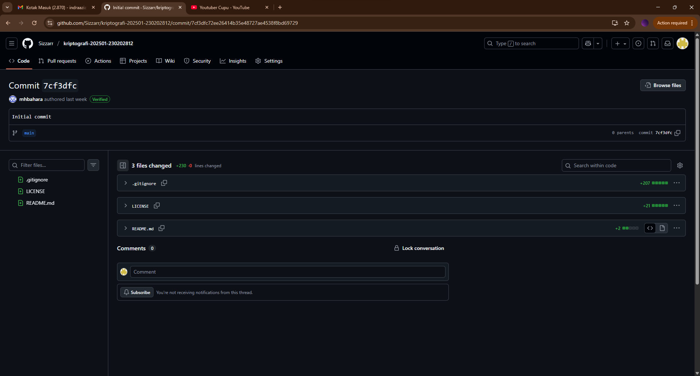

# Laporan Praktikum Kriptografi
Minggu ke-: 1  
Topik: week1-intro-cia    
Nama: Indra Fata Nizar Azizi   
NIM: 230202812  
Kelas: 5IKRA  

---

## 1. Tujuan
1. Menjelaskan sejarah dan evolusi kriptografi dari masa klasik hingga modern.
2. Menyebutkan prinsip Confidentiality, Integrity, Availability (CIA) dengan benar.
3. Menyimpulkan peran kriptografi dalam sistem keamanan informasi modern.
4. Menyiapkan repositori GitHub sebagai media kerja praktikum.

---

## 2. Dasar Teori
Di era Kriptografi klasik, membuat sandi rahasia itu seperti seni yang mengandalkan trik-trik tertentu. Sandi Vigenère adalah salah satu yang paling canggih saat itu. Ia menggunakan kunci yang diulang-ulang untuk mengacak pesan untuk membuat poly-alphabetic substitution, sehingga sulit ditembus dengan cara menganalisa frekuensi huruf biasa. Namun, para ahli akhirnya menemukan cara memecahkannya dengan mencari pola-pola tertentu dalam pesan terenkripsi melalui metode kriptanalisis sistematis seperti Kasiski's method dan Index of Coincidence yang memanfaatkan pola-pola statistik tanpa memerlukan definisi keamanan formal atau bukti matematis. Pada era ini, keamanan sebuah sandi hanya berdasarkan perasaan "kelihatannya rumit", bukan pada ilmu yang pasti.

Memasuki zaman modern, kriptografi berubah dari seni menjadi ilmu pasti. Rahasia tidak lagi disembunyikan, tapi justru dijamin dengan rumus matematika yang sangat sulit dipecahkan. RSA adalah salah satunya, Ia menggunakan sepasang kunci: kunci publik untuk mengunci (mengenkripsi) dan kunci privat untuk membuka kunci (mendekripsi). Keamanannya bergantung pada kesulitan memfaktorkan bilangan yang sangat besar menjadi bilangan primanya. Yang terpenting, keamanan RSA bisa dibuktikan secara matematis, bukan hanya dikira-kira. Jika ada yang bisa memecahkan RSA, berarti mereka juga bisa memecahkan masalah matematika dasar yang selama ini dianggap sulit oleh para ilmuwan.

Perkembangan terbaru menggabungkan berbagai "alat rahasia" modern untuk menciptakan sistem yang lebih cerdas lagi, seperti blockchain yang jadi dasar cryptocurrency. Bayangkan blockchain seperti buku catatan digital raksasa yang disimpan oleh banyak orang secara bersamaan. Untuk menjaganya agar tidak bisa dimanipulasi, digunakanlah fungsi Hash seperti "cap digital" unik untuk setiap halaman buku. Jika isi halaman diubah sedikit, capnya akan berubah total dan ketahuan, tanda tangan digital itu seperti tanda tangan di cek, membuktikan bahwa hanya pemilik sah yang bisa mengirim aset digitalnya. Dengan menggabungkan kedua alat ini, terciptalah sistem kepercayaan yang tidak butuh bank atau pemerintah sebagai perantara. Inilah wujud nyata dari evolusi kriptografi dari sekadar menyembunyikan pesan, menjadi menciptakan kepercayaan di dunia digital.

- Confidentiality (Kerahasiaan) Confidentiality adalah upaya usaha untuk mencegah terungkapnya informasi yang bersifat
rahasia dan sensitif. Tujuannya adalah memastikan bahwa data hanya dapat diakses oleh orang yang memiliki hak akses.

contohnya : Saat mengirim pesan rahasia, pengirim dan penerima harus memiliki tabung dengan ukuran dan diameter yang identik. Pesan ditulis
pada gulungan kertas yang hanya dapat dibaca jika dililitkan pada tabung tersebut; jika tidak sesuai ukuran, 
isi gulungan tidak akan terbaca. Dengan demikian, jika pesan dicuri, pencuri tidak akan bisa membacanya.
- Integrity atau keamanan adalah dimana data tidak bisa diganti, dibuat atau dihapus tanpa
adanya proses otorisasi. Integrity merupakan prinsip yang ditujukan untuk menjaga
keakuratan suatu informasi. tujuanya Mencegah akses yang tidak sah atau modifikasi informasi yang tidak disengaja maupun disengaja

contohnya : ketika kita ingin membuat sebuat akun kita disuruh untuk memverifikasi otp yang dikirimkan ke email/no hp untuk mengetahui
apakah orang ini yang mendaftar atau bukan jika iya maka bisa melanjutkan pembuatan akun jika tidak maka tidak bisa lanjut.
- Availability (Ketersediaan) adalah memastikan agar sistem yang berhak memiliki
akses tanpa adanya interupsi sistem dan jaringan dengan memastikan agar informasi atau
sumber daya akan selalu tersedia ketika dibutuhkan

contohnya : Sebuah situs e-commerce menggunakan beberapa server di lokasi berbeda. Jika satu server mengalami gangguan 
(misalnya karena serangan DDoS), server lain dapat mengambil alih sehingga layanan tetap berjalan dan pelanggan tetap dapat berbelanja.

---

## 3. Alat dan Bahan
- Git dan akun GitHub
- CMD / terminal

## 4. Langkah Percobaan
### Langkah 1 — Ringkasan Sejarah Kriptografi
Tuliskan ringkasan (maks. 1 halaman) yang mencakup:  
- Era **kriptografi klasik** (contoh: Caesar Cipher, Vigenere).  
- Perkembangan **kriptografi modern** (contoh: AES, RSA).  
- Evolusi menuju **kriptografi kontemporer** (misalnya: blockchain, cryptocurrency).  

### Langkah 2 — Prinsip CIA
Jelaskan tiga pilar keamanan informasi:  
- **Confidentiality** → menjaga kerahasiaan data.  
- **Integrity** → menjaga keutuhan data dari modifikasi tidak sah.  
- **Availability** → menjamin ketersediaan layanan sistem.  

Tambahkan contoh nyata minimal 1 untuk tiap aspek.  

### Langkah 3 — Dokumentasi
- Simpan ringkasan di `laporan.md`.  
- Buat screenshot evidence setup repo GitHub (`repo name`, `initial commit`). Simpan di folder `screenshots/`.  
- Lampirkan screenshot di laporan menggunakan sintaks Markdown:  
  ```markdown
  
  ```

### Langkah 4 — Quiz Singkat
Jawab pertanyaan berikut di laporan:  
1. Siapa tokoh yang dianggap sebagai bapak kriptografi modern?  
2. Sebutkan algoritma kunci publik yang populer digunakan saat ini.  
3. Apa perbedaan utama antara kriptografi klasik dan kriptografi modern?

---

## 5. Source Code
(Salin kode program utama yang dibuat atau dimodifikasi.  
Gunakan blok kode:

```bash
git clone https://github.com/Sizzarr/kripto-20251-230202812.git
```
)

---

## 6. Hasil dan Pembahasan
(- Lampirkan screenshot hasil eksekusi program (taruh di folder `screenshots/`).  


## 7. Jawaban Pertanyaan
(Jawab pertanyaan diskusi yang diberikan pada modul.  
- Pertanyaan 1: Claude Elwood Shannon
- Pertanyaan 2: RSA (Rivest–Shamir–Adleman), Advanced Encryption Standard (AES), SHA-256 (Secure Hash Algorithm 256-bit)
- Pertanyaan 3: Perbedaan utamanya adalah kriptografi klasik masih memakai mode huruf sedangkan kriptografi moderen menggunakan mode bit (0 dan 1)

)

---

## 8. Kesimpulan
Kriptografi telah berevolusi dari seni menyembunyikan pesan yang mengandalkan kerumitan semata menjadi sebuah ilmu pasti 
yang berdasar pada pembuktian matematis. Pada era modern, kriptografi tidak hanya menjamin kerahasiaan tetapi juga mampu 
menciptakan sistem kepercayaan digital tanpa perantara, seperti yang terlihat pada teknologi blockchain.

---

## 9. Daftar Pustaka
(Cantumkan referensi yang digunakan.  
Contoh:  
- Katz, J., & Lindell, Y. *Introduction to Modern Cryptography*.
- Munir, R. (2019). Kriptografi (2nd ed.). Informatika
- Ahmad Fauzi, Maidani ., M. Fadhli Nursal, Farhan Saputra, Pengaruh Akuntabilitas, Independensi dan Kompetensi Auditor terhadap Kualitas Audit (Studi Kasus pada Kantor Akuntan Publik di Wilayah Kota Bekasi) , Jurnal Manajemen dan Pemasaran Digital: Vol. 1 No. 3 (2023): Jurnal Manajemen dan Pemasaran Digital (Juli - September 2023)
- Integrasolusi. (n.d.). Cryptography: bagaimana cara kerjanya. https://integrasolusi.com/lain-lain/cryptography-bagaimana-cara-kerjanya/#:~:text=Algoritma%20Kriptografi%20Populer,digunakan%20untuk%20memverifikasi%20integritas%20data
- Prapanca.id. (2024, Mei 15). Claude Shannon, bapak teori informasi dan pionir komunikasi modern. Prapanca.id. https://www.prapanca.id/claude-shannon-bapak-teori-informasi-dan-pionir-komunikasi-modern/

---

## 10. Commit Log
(Tuliskan bukti commit Git yang relevan.  
Contoh:
```
commit week1-intro-cia
Author: Indra Fata Nizar Azizi <indrafata980@gmail.com>
Date:   2025-10-5

    week1-intro-cia: meringkas Sejarah Kriptografi, menejelaskan Prinsip CIA )
```
