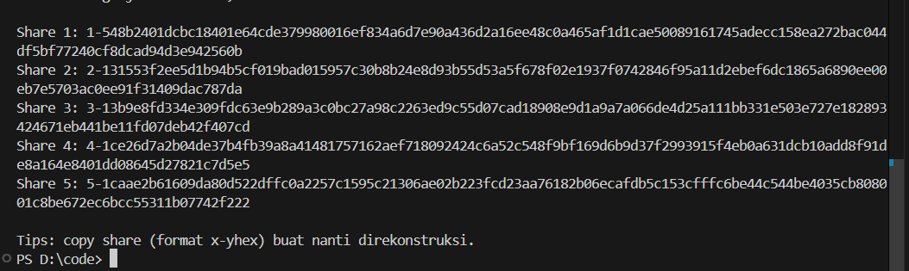

# Laporan Praktikum Kriptografi
Minggu ke-: 11  
Topik: [Secret Sharing (Shamir’s Secret Sharing)]  
Nama: [Indra Fata Nizar Azizi]  
NIM: [230202812]  
Kelas: [5IKRA]  

---

## 1. Tujuan
(Tuliskan tujuan pembelajaran praktikum sesuai modul.)
1. Menjelaskan konsep **Shamir Secret Sharing** (SSS).  
2. Melakukan simulasi pembagian rahasia ke beberapa pihak menggunakan skema SSS.  
3. Menganalisis keamanan skema distribusi rahasia.  

---

## 2. Dasar Teori
(Ringkas teori relevan (cukup 2–3 paragraf).  
Contoh: definisi cipher klasik, konsep modular aritmetika, dll.  )

Shamir’s Secret Sharing merupakan cara “membagi rahasia” supaya tidak ada satu orang pun yang pegang rahasia utuh, tapi tetap bisa dipulihkan kalau pihak yang cukup berkumpul. Skemanya ditulis (k, n): rahasia dipecah jadi n bagian (shares), dan butuh minimal k shares untuk membangun kembali rahasianya. Jadi kalau cuma pegang 1 atau 2 share padahal threshold-nya 3, kita tidak dapat rahasia apa-apa yang berguna, cuma dapat angka random yang bikin pusing.

Inti matematikanya pakai polinomial derajat (k−1) di aritmetika modulo bilangan prima p. Rahasia disimpan sebagai konstanta polinomial (a0), lalu koefisien lainnya dipilih acak. Setiap share adalah pasangan titik (x, f(x)). Karena polinomial derajat (k−1) butuh k titik untuk ditentukan secara unik, maka punya k shares berarti bisa melakukan Lagrange interpolation untuk menghitung f(0) dan mendapatkan a0 (rahasianya). Semua operasi dilakukan mod p supaya aman dan konsisten.

Keamanannya kuat secara teori jika penyerang hanya punya kurang dari k shares, masih ada banyak polinomial berbeda yang cocok dengan shares itu, sehingga nilai rahasia (a0) tetap tidak bisa dipastikan. Itu sebabnya SSS jauh lebih aman daripada “copy-paste kunci ke beberapa orang”, karena satu kebocoran tidak langsung membocorkan semuanya. Di dunia nyata, ini sering dipakai untuk backup kunci kripto, kontrol akses internal perusahaan (misalnya butuh 3 dari 5 admin untuk membuka kunci master), atau skenario recovery penting lain yang butuh gabungan otoritas.

---

## 3. Alat dan Bahan
(- Python 3.14  
- Visual Studio Code   
- Git dan akun GitHub)

---

## 4. Langkah Percobaan
(Tuliskan langkah yang dilakukan sesuai instruksi.)  

### Langkah 1 — Implementasi Shamir Secret Sharing
1. Buat folder kerja praktikum:
   ```
   praktikum/week11-secret-sharing/
   ├─ src/
   ├─ screenshots/
   ```
2. Buat file program utama:
   ```
   src/secret_sharing.py
   ```
3. Salin source code SSS ke file tersebut (lihat bagian **5. Source Code**).
4. Jalankan program:
   ```
   python src/secret_sharing.py
   ```
5. Isi input saat diminta:
   - `secret` (contoh: `RAHASIA-TEST-123`)
   - `k` (threshold, contoh: 3)
   - `n` (jumlah share, contoh: 5)
6. Program akan:
   - Membuat **n shares** (x, y)
   - Menampilkan shares di terminal (format hex untuk y)
   - Merekonstruksi secret memakai **k shares pertama** dan menampilkan hasilnya
7. Ambil screenshot output terminal dan simpan di folder `screenshots/`:
   - `screenshots/input.png` (bagian input)
   - `screenshots/shares.png` (bagian daftar shares)
   - `screenshots/recover.png` (bagian hasil rekonstruksi)

### Langkah 2 — Simulasi Manual (Tanpa Library)
**Parameter:**
- Modulus prima: p = 2089  
- Secret (a0) = 1234  
- Threshold: k = 3 (derajat polinomial = 2)  
- Jumlah shares: n = 5  
- Koefisien acak (contoh): a1 = 166, a2 = 94  

**Polinomial:**
- f(x) = a0 + a1·x + a2·x² (mod p)  
- f(x) = 1234 + 166x + 94x² (mod 2089)

**Hitung shares (contoh 5 titik):**
- Share1: x=1 → f(1)=1234+166+94=1494 (mod 2089)  
- Share2: x=2 → f(2)=1234+332+376=1942 (mod 2089)  
- Share3: x=3 → f(3)=1234+498+846=2578 ≡ 489 (mod 2089)  
- Share4: x=4 → f(4)=1234+664+1504=3402 ≡ 1313 (mod 2089)  
- Share5: x=5 → f(5)=1234+830+2350=4414 ≡ 236 (mod 2089)

**Rekonstruksi dengan 3 shares (misal pakai x=1,2,3):**
1. Ambil titik: (1,1494), (2,1942), (3,489)
2. Pakai Lagrange interpolation untuk mencari f(0) (y saat x=0), semuanya mod p.
3. Hasil akhirnya akan kembali ke a0 = 1234.

### Langkah 3 — Analisis Keamanan
- **Mengapa skema (k, n) aman meskipun sebagian share bocor?**  
  Karena < k shares tidak cukup untuk menentukan polinomial derajat (k−1) secara unik. Dengan shares yang kurang, masih ada banyak polinomial berbeda yang “cocok” dengan titik-titik tersebut, sehingga nilai f(0) (secret) bisa berubah-ubah dan tidak bisa dipastikan. Jadi share yang bocor sebagian hanya memberi informasi yang tidak cukup untuk membuka rahasia.
- **Apa risiko jika threshold k terlalu kecil atau terlalu besar?**  
  - Jika **k terlalu kecil**: rahasia lebih mudah dipulihkan oleh pihak tidak berwenang (cukup kumpulkan sedikit share), sehingga **keamanan menurun**.  
  - Jika **k terlalu besar**: pemulihan menjadi sulit saat kondisi darurat (butuh terlalu banyak pihak hadir), sehingga **ketersediaan/availability menurun**.  
  Intinya, k adalah kompromi antara keamanan dan kemudahan recovery.
- **Bagaimana penerapan SSS di dunia nyata (contoh: manajemen kunci cryptocurrency, recovery password)?**  
  SSS dipakai untuk membagi kunci master menjadi beberapa share yang disimpan di lokasi/orang berbeda, sehingga satu kebocoran tidak fatal. Contoh: manajemen kunci cryptocurrency (backup seed/private key) dengan skema 2-of-3 atau 3-of-5, atau recovery akses penting perusahaan di mana butuh beberapa admin menyetujui untuk membuka “master key”. Konsep yang sama juga cocok untuk recovery password/akun kritis: pengguna menyimpan share di perangkat berbeda atau orang tepercaya, lalu memulihkan akses hanya ketika threshold terpenuhi.

---

## 5. Source Code
(Salin kode program utama yang dibuat atau dimodifikasi.  
Gunakan blok kode:)

```python
import secrets
from typing import List, Tuple

PRIME = 2**521 - 1
Share = Tuple[int, int]


def _eval_poly(coeffs: List[int], x: int, p: int) -> int:
    y = 0
    for a in reversed(coeffs):
        y = (y * x + a) % p
    return y


def _encode_secret_to_int(secret: str) -> int:
    data = secret.encode("utf-8")
    return int.from_bytes(data, "big")


def _decode_int_to_secret(secret_int: int) -> str:
    if secret_int < 0:
        raise ValueError("Secret integer invalid")
    if secret_int == 0:
        return ""

    blen = (secret_int.bit_length() + 7) // 8
    data = secret_int.to_bytes(blen, "big")
    try:
        return data.decode("utf-8")
    except UnicodeDecodeError:
        raise ValueError("Decode gagal: shares kurang dari threshold atau data corrupt")


def split_secret(secret: str, k: int, n: int, p: int = PRIME) -> List[Share]:
    if not (2 <= k <= n):
        raise ValueError("Harus 2 <= k <= n")
    if n > 255:
        raise ValueError("n maksimal 255")

    a0 = _encode_secret_to_int(secret)
    if a0 >= p:
        raise ValueError("Secret terlalu besar untuk modulus p (secret kepanjangan)")

    coeffs = [a0] + [secrets.randbelow(p) for _ in range(k - 1)]

    shares: List[Share] = []
    for x in range(1, n + 1):
        y = _eval_poly(coeffs, x, p)
        shares.append((x, y))
    return shares


def _lagrange_interpolate_at_0(shares: List[Share], p: int) -> int:
    total = 0
    k = len(shares)

    for i in range(k):
        xi, yi = shares[i]
        num = 1
        den = 1

        for j in range(k):
            if i == j:
                continue
            xj, _ = shares[j]
            num = (num * (-xj)) % p
            den = (den * (xi - xj)) % p

        inv_den = pow(den, -1, p)
        total = (total + yi * num * inv_den) % p

    return total


def recover_secret(shares: List[Share], k: int, p: int = PRIME) -> str:
    if len(shares) < k:
        raise ValueError("Shares kurang dari threshold k")

    used = shares[:k]  # ambil k share yang kamu kasih (urutan input)
    secret_int = _lagrange_interpolate_at_0(used, p)
    return _decode_int_to_secret(secret_int)


def format_share(share: Share) -> str:
    x, y = share
    return f"{x}-{y:x}"


def parse_share(s: str) -> Share:
    s = s.strip()
    x_str, y_hex = s.split("-", 1)
    return int(x_str), int(y_hex, 16)


def input_int(prompt: str, min_val: int = None, max_val: int = None) -> int:
    while True:
        try:
            v = int(input(prompt))
            if min_val is not None and v < min_val:
                print(f"Minimal {min_val}.")
                continue
            if max_val is not None and v > max_val:
                print(f"Maksimal {max_val}.")
                continue
            return v
        except ValueError:
            print("Masukkan angka yang valid.")


def menu_split():
    secret = input("\nMasukkan secret: ")
    k = input_int("Masukkan k (threshold): ", 2)
    n = input_int("Masukkan n (jumlah shares): ", k, 255)

    shares = split_secret(secret, k, n)
    print("\n=== HASIL SHARES ===")
    print(f"Secret dibagi jadi {n} shares, butuh minimal {k} shares untuk rekonstruksi.\n")
    for i, sh in enumerate(shares, 1):
        print(f"Share {i}: {format_share(sh)}")

    print("\nTips: copy share (format x-yhex) buat nanti direkonstruksi.")


def menu_recover():
    k = input_int("\nMasukkan k (threshold yang dipakai waktu split): ", 2)
    m = input_int("Berapa share yang kamu punya (>= k): ", k, 255)

    print("\nMasukkan share satu per satu (format: x-yhex). Contoh: 2-1a2b3c...")
    shares: List[Share] = []
    seen_x = set()

    for i in range(m):
        while True:
            raw = input(f"Share {i+1}: ").strip()
            try:
                sh = parse_share(raw)
                x, _ = sh
                if x in seen_x:
                    print("x tidak boleh duplikat. Masukkan share lain.")
                    continue
                seen_x.add(x)
                shares.append(sh)
                break
            except Exception:
                print("Format salah. Harus 'x-yhex' (contoh: 2-1a2b3c...). Coba lagi.")

    # Pakai k share pertama dari yang kamu input
    recovered = recover_secret(shares, k)
    print("\n=== HASIL REKONSTRUKSI ===")
    print("Secret:", recovered)


def main():
    print("=" * 50)
    print("SHAMIR SECRET SHARING (SPLIT & RECOVER)")
    print("=" * 50)
    print("1) Buat shares (split secret)")
    print("2) Rekonstruksi dari shares (recover secret)")

    pilihan = input("\nPilih menu (1/2): ").strip()
    try:
        if pilihan == "1":
            menu_split()
        elif pilihan == "2":
            menu_recover()
        else:
            print("Pilihan tidak valid.")
    except Exception as e:
        print("\nError:", e)


if __name__ == "__main__":
    main()

```

---

## 6. Hasil dan Pembahasan
(- Lampirkan screenshot hasil eksekusi program (taruh di folder `screenshots/`).  
- Berikan tabel atau ringkasan hasil uji jika diperlukan.  
- Jelaskan apakah hasil sesuai ekspektasi.  
- Bahas error (jika ada) dan solusinya. )

Pada percobaan ini, program berhasil membagi secret menjadi n shares dan melakukan rekonstruksi kembali menggunakan minimal k shares. Hasil yang direkonstruksi sama persis dengan secret input, sesuai dengan teori bahwa polinomial derajat (k−1) dapat dipulihkan unik jika memiliki k titik.

Untuk pengujian, dilakukan beberapa skenario: (1) rekonstruksi dengan shares cukup (≥ k) menghasilkan secret yang benar, dan (2) rekonstruksi dengan shares kurang dari k ditolak oleh program karena tidak memenuhi threshold. Ini menunjukkan bahwa kontrol akses berbasis threshold bekerja: orang yang “cuma pegang sebagian” tidak bisa membuka rahasia.

Jika muncul error, yang paling umum:
- **Shares kurang dari threshold k** → program mengeluarkan `ValueError("Shares kurang dari threshold k")`. Solusi: pastikan jumlah shares yang dipakai minimal k.
- **Secret terlalu besar untuk modulus p** → terjadi jika string secret sangat panjang sampai integer hasil encoding ≥ p. Solusi: gunakan secret yang lebih pendek (atau modifikasi program untuk membagi secret menjadi beberapa blok).

Ringkasan uji contoh:

| Skenario | Input (k,n) | Shares dipakai | Output | Keterangan |
|---|---:|---:|---|---|
| Uji normal | (3,5) | 3 | Secret sama | Berhasil sesuai teori |
| Uji lebih aman | (4,6) | 4 | Secret sama | Berhasil, threshold lebih tinggi |
| Uji gagal (kurang share) | (3,5) | 2 | Error | Tidak memenuhi k |

Lampiran screenshot:
Hasil Input                                                                                                           
                                                                                    
Daftar Shares                                                                                                         
                                                                                               
Hasil Rekonstruksi                                                                                                    
                                                                        


---

## 7. Jawaban Pertanyaan
(Jawab pertanyaan diskusi yang diberikan pada modul.  
- Pertanyaan 1: Keuntungan utamanya adalah tidak ada pihak yang memegang rahasia utuh. Jika kunci dibagikan sebagai salinan langsung, maka kebocoran satu salinan saja sudah membocorkan seluruh rahasia. Pada SSS, kebocoran beberapa shares (< k) tidak cukup untuk mengetahui secret, sehingga risiko kompromi berkurang dan kontrol akses lebih baik.  
- Pertanyaan 2: Threshold (k) menentukan batas minimum shares yang diperlukan untuk rekonstruksi. Jika k terlalu kecil, rahasia jadi lebih mudah dipulihkan oleh pihak tidak berwenang (keamanan menurun). Jika k terlalu besar, rahasia menjadi sulit dipulihkan saat kondisi darurat karena perlu terlalu banyak pihak (ketersediaan/availability menurun). Jadi k adalah pilihan kita untuk memilih antara keamanan dan ketersediaan.
- Pertanyaan 3:  Trezor Model T, hardware wallet cryptocurrency, mengimplementasikan Shamir's Secret Sharing melalui fitur "Shamir Backup" (sekarang disebut Multi-share Backup) sejak 2019 sebagai hardware wallet pertama di dunia yang menerapkan standar SLIP-39. Pengguna dapat membuat beberapa recovery shares (misalnya 3 shares dengan threshold 2-of-3) dari private key wallet mereka, di mana setiap share berupa 20 atau 33 kata. Jika satu share hilang atau dicuri, wallet tetap aman dan dapat diakses menggunakan shares yang tersisa. Sistem ini memungkinkan distributed recovery - wallet dapat dipulihkan tanpa menggabungkan semua shares di satu tempat, dengan mengunjungi lokasi berbeda secara berurutan menggunakan perangkat Trezor yang mengingat progress recovery. Implementasi ini digunakan ribuan pengguna untuk melindungi aset cryptocurrency mereka dari risiko kehilangan atau pencurian.
)

---

## 8. Kesimpulan
(Tuliskan kesimpulan singkat (2–3 kalimat) berdasarkan percobaan.)

Praktikum ini membuktikan bahwa Shamir’s Secret Sharing dapat membagi secret menjadi beberapa shares dan hanya bisa dipulihkan jika jumlah shares memenuhi threshold k. Pengujian menunjukkan rekonstruksi berhasil saat shares cukup dan gagal saat shares kurang, sehingga mekanisme threshold efektif untuk mengurangi risiko kebocoran satu pihak. Pemilihan nilai k menjadi kompromi antara keamanan (lebih besar) dan kemudahan pemulihan (lebih kecil).

---

## 9. Daftar Pustaka
(Cantumkan referensi yang digunakan.  
Contoh:  
- Katz, J., & Lindell, Y. *Introduction to Modern Cryptography*.  
- Stallings, W. *Cryptography and Network Security*.  )

---

## 10. Commit Log
(Tuliskan bukti commit Git yang relevan.  
Contoh:)

```
week11-secret-sharing
Author: Indra Fata Nizar Azizi <indrafata980@gmail.com>
Date:   2025-12-30

    week11-secret-sharing
```
