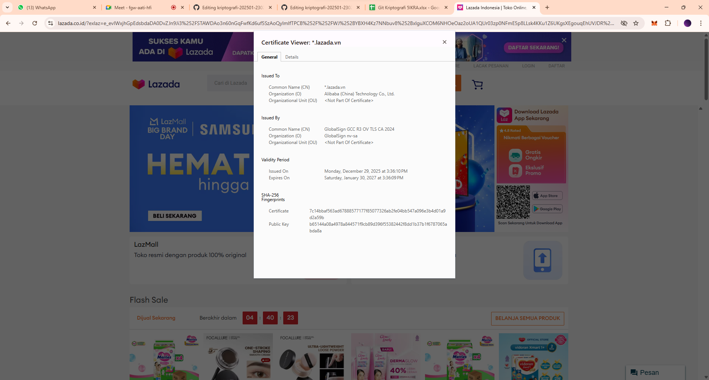
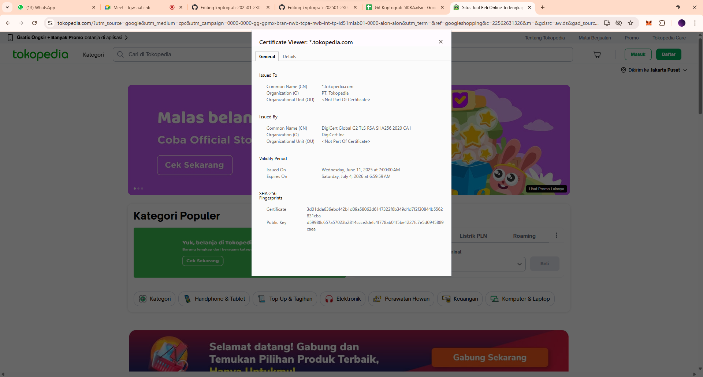
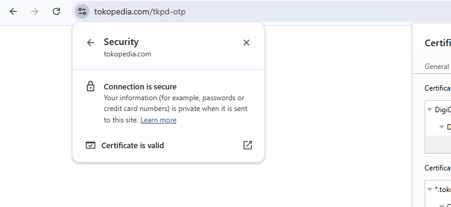
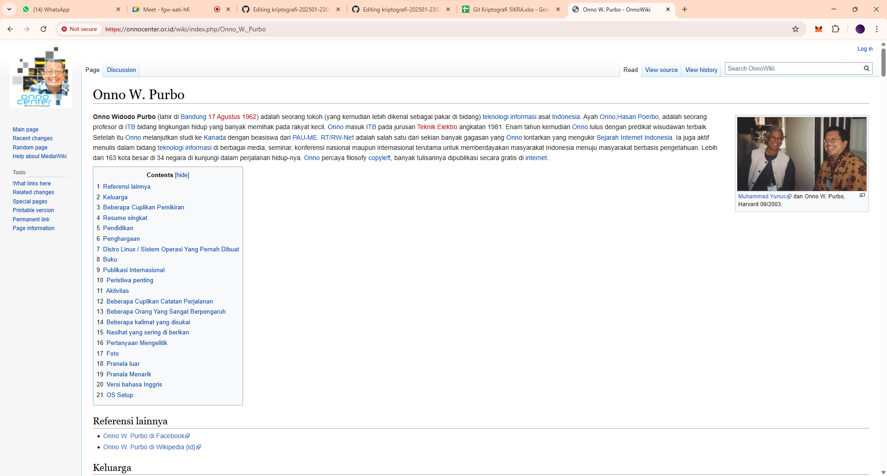

# Laporan Praktikum Kriptografi
Minggu ke-: 12  
Topik: [Aplikasi TLS & E-commerce]  
Nama: [Indra Fata Nizar Azizi]  
NIM: [230202812]  
Kelas: [5IKRA]  

---

## 1. Tujuan
(Tuliskan tujuan pembelajaran praktikum sesuai modul.)
Setelah mengikuti praktikum ini, mahasiswa diharapkan mampu:  
1. Menganalisis penggunaan kriptografi pada **email** dan **SSL/TLS**.  
2. Menjelaskan enkripsi dalam transaksi **e-commerce**.  
3. Mengevaluasi isu **etika & privasi** dalam penggunaan kriptografi di kehidupan sehari-hari.
---

## 2. Dasar Teori
(Ringkas teori relevan (cukup 2–3 paragraf).  
Contoh: definisi cipher klasik, konsep modular aritmetika, dll.  )

Aplikasi TLS & E-commerce membahas bagaimana kriptografi dipakai untuk mengamankan komunikasi digital, khususnya pada email dan koneksi web. Pada email, konsep keamanan umumnya mencakup kerahasiaan isi pesan dan pembuktian keaslian pengirim melalui enkripsi dan tanda tangan digital (misalnya konsep PGP/S/MIME). Sementara pada TLS (SSL/TLS), kriptografi bekerja lewat proses handshake untuk memverifikasi identitas server menggunakan sertifikat, lalu membentuk kunci sesi agar pertukaran data selanjutnya terenkripsi dan terlindungi dari penyadapan maupun manipulasi selama transmisi.

Dalam konteks e-commerce, TLS menjadi lapisan utama yang melindungi data sensitif seperti kredensial login, alamat, hingga detail transaksi saat dikirim antara client dan server. Namun keamanan transaksi tidak berhenti di “ikon gembok” browser. Sistem e-commerce juga menerapkan prinsip kriptografi di sisi aplikasi, seperti penyimpanan password menggunakan hash yang aman, penggunaan token/sesi untuk autentikasi, serta mekanisme integritas data transaksi agar nilai pembayaran atau identitas pesanan tidak bisa diubah pihak lain. Kombinasi perlindungan jalur komunikasi dan pengamanan data aplikasi ini memastikan transaksi tetap rahasia, utuh, dan dapat dipercaya.

Selain aspek teknis, penggunaan kriptografi menimbulkan isu etika dan privasi di kehidupan sehari-hari. Enkripsi melindungi pengguna dari pencurian data dan pelacakan, tetapi juga memunculkan perdebatan soal akses pihak tertentu, keamanan metadata (pola komunikasi bisa tetap terlihat meski isi terenkripsi), serta tanggung jawab penyedia layanan untuk tidak mengumpulkan data berlebihan. Karena itu evaluasi tidak hanya menilai “apakah terenkripsi”, tetapi juga apakah penerapan kriptografi mendukung prinsip privasi, transparansi, dan perlindungan pengguna secara nyata, bukan sekadar formalitas keamanan.

---

## 3. Alat dan Bahan
(- Visual Studio Code 
- Git dan akun GitHub
- browser chrome )

---

## 4. Langkah Percobaan
(Tuliskan langkah yang dilakukan sesuai instruksi.  
Contoh format:
### Langkah 1 — Analisis SSL/TLS pada Email & Web
- Gunakan browser Chrome untuk mengecek **sertifikat digital** pada website e-commerce Lazada dan tokopedia.
- Website 1 — Lazada 
- Catat informasi berikut:  
  - Issuer CA (Certificate Authority).
  -   Common Name (CN)	GlobalSign GCC R3 OV TLS CA 2024
  -   Organization (O)	GlobalSign nv-sa
  -   Organizational Unit (OU)	<Not Part Of Certificate>

  - Masa berlaku sertifikat.
  -     Issued On	Monday, December 29, 2025 at 3:36:10 PM
  -     Expires On	Saturday, January 30, 2027 at 3:36:09 PM
 
  - Algoritma enkripsi yang digunakan (PKCS #1 SHA-256 With RSA Encryption).
 
- Website 1 — Tokopedia
- Catat informasi berikut:  
  - Issuer CA (Certificate Authority).
  -   Common Name (CN)	DigiCert Global G2 TLS RSA SHA256 2020 CA1
  -   Organization (O)	DigiCert Inc
  -   Organizational Unit (OU)	<Not Part Of Certificate>

  - Masa berlaku sertifikat.
      -     Issued On	Wednesday, June 11, 2025 at 7:00:00 AM
      -     Expires On	Saturday, July 4, 2026 at 6:59:59 AM
 
  - Algoritma enkripsi yang digunakan (PKCS #1 SHA-256 With RSA Encryption).
      
- Bandingkan perbedaan antara website **dengan HTTPS** dan **tanpa HTTPS**.
- Pada HTTPS, browser menampilkan ikon gembok dan koneksi terenkripsi menggunakan TLS, sehingga data yang lewat jaringan lebih sulit disadap atau dimodifikasi.
- Pada HTTP (tanpa TLS), data dikirim plaintext sehingga rentan disadap (sniffing) dan rentan dimanipulasi (injection). Browser biasanya menandai sebagai Not Secure. 


### Langkah 2 — Studi Kasus E-commerce
- Pada e-commerce, TLS melindungi:
    - Login: username/password dan token sesi (cookie) agar tidak dicuri saat transmisi.
    - Checkout & alamat: data pribadi (PII) seperti alamat dan nomor telepon.
    - Pembayaran: detail transaksi (nomor pesanan, nominal) agar tidak diubah pihak ketiga.
- Jika TLS tidak digunakan, ancaman yang mungkin:
    - Man-in-the-Middle (MITM): penyerang di jaringan (Wi-Fi publik) bisa menyadap atau mengubah data transaksi.
    - Session hijacking: cookie sesi bisa dicuri sehingga akun pengguna dapat diambil alih.
    - Phishing/injection: halaman dapat dimodifikasi untuk mengarahkan pengguna mengisi data ke pihak penyerang.
---

## 5. Source Code
(Salin kode program utama yang dibuat atau dimodifikasi.  
Gunakan blok kode:

```python
# contoh potongan kode
def encrypt(text, key):
    return ...
```
)

---

## 6. Hasil dan Pembahasan
(- Lampirkan screenshot hasil eksekusi program (taruh di folder `screenshots/`).  
| Aspek                  | Lazada                                                | Tokopedia                                  |
| ---------------------- | ----------------------------------------------------- | ------------------------------------------ |
| Domain/CN              | `*.lazada.vn`                                         | `*.tokopedia.com`                          |
| Organization (pemilik) | Alibaba (China) Technology Co., Ltd.                  | PT. Tokopedia                              |
| Issuer CA              | GlobalSign GCC R3 OV TLS CA 2024                      | DigiCert Global G2 TLS RSA SHA256 2020 CA1 |
| Masa berlaku           | 29 Des 2025 → 30 Jan 2027                             | 11 Jun 2025 → 04 Jul 2026                  |
| Petunjuk algoritma     | RSA + SHA-256                                         | RSA + SHA-256                              |






)

---

## 7. Jawaban Pertanyaan
(Jawab pertanyaan diskusi yang diberikan pada modul.  
- Pertanyaan 1: HTTP mengirim data tanpa enkripsi sehingga rentan disadap dan dimodifikasi. HTTPS adalah HTTP yang berjalan di atas TLS sehingga menyediakan kerahasiaan (encryption), integritas (mencegah perubahan data), dan autentikasi server melalui sertifikat digital.  
- Pertanyaan 2: Sertifikat digital berfungsi untuk membuktikan identitas server (domain benar milik pemilik sah) melalui rantai kepercayaan CA. Sertifikat juga menyediakan informasi kunci publik sehingga proses handshake dapat membuat kunci sesi dengan aman. Tanpa sertifikat yang valid, pengguna rentan terhubung ke server palsu (phishing/MITM).
- Pertanyaan 3: Kriptografi melindungi privasi dengan menjaga data tetap rahasia dan utuh dari penyadapan. Namun, enkripsi juga menyulitkan pihak tertentu (misalnya penegak hukum) untuk melakukan investigasi, sehingga muncul debat tentang “akses khusus” (backdoor) vs hak privasi. Tantangan etika muncul ketika pengawasan dilakukan berlebihan atau tanpa transparansi, sedangkan tantangan hukum terkait batas kewenangan dan prosedur akses terhadap data komunikasi.   
)
---

## 8. Kesimpulan
(Tuliskan kesimpulan singkat (2–3 kalimat) berdasarkan percobaan.  )

TLS/HTTPS berperan penting dalam keamanan e-commerce dengan mengenkripsi komunikasi dan memverifikasi identitas server melalui sertifikat digital. Selain meningkatkan kerahasiaan dan integritas data, penerapan kriptografi juga perlu mempertimbangkan isu privasi dan etika agar pengawasan tidak melanggar hak pengguna.

---

## 9. Daftar Pustaka
(Cantumkan referensi yang digunakan.  
Contoh:  
.  )

---

## 10. Commit Log
(Tuliskan bukti commit Git yang relevan.  
Contoh:
```
week12-aplikasi-tls
Author: Indra Fata Nizar Azizi <indrafata980@gmail.com>
Date:   2026-1-13

    week12-aplikasi-tls
```
