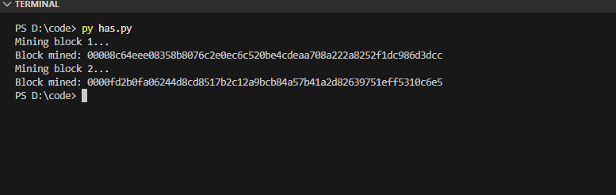

# Laporan Praktikum Kriptografi
Minggu ke-: 13  
Topik: [TinyChain – Proof of Work (PoW)]  
Nama: [Indra Fata Nizar Azizi]  
NIM: [230202812]  
Kelas: [5IKRA]  

---

## 1. Tujuan
(Tuliskan tujuan pembelajaran praktikum sesuai modul.)
1. Menjelaskan peran **hash function** dalam blockchain.  
2. Melakukan simulasi sederhana **Proof of Work (PoW)**.  
3. Menganalisis keamanan cryptocurrency berbasis kriptografi. 
---

## 2. Dasar Teori
(Ringkas teori relevan (cukup 2–3 paragraf).  
Contoh: definisi cipher klasik, konsep modular aritmetika, dll.  )

Hash function berperan sebagai “sidik jari” data pada blockchain. Setiap transaksi dan isi blok diubah menjadi nilai hash berukuran tetap. Jika data diubah sedikit saja, hash akan berubah drastis sehingga manipulasi mudah terdeteksi. Selain itu, setiap blok menyimpan hash blok sebelumnya sehingga blok-blok saling terhubung; mengubah satu blok akan merusak keterkaitan hash pada blok setelahnya. Akibatnya, hash function menjaga integritas data dan membuat riwayat transaksi sulit diubah tanpa diketahui.

Simulasi sederhana Proof of Work (PoW) dapat dijelaskan dengan konsep pencarian nonce. Penambang menggabungkan data blok dengan sebuah angka (nonce), lalu menghitung hash dari gabungan tersebut. Tujuannya adalah menemukan nonce yang menghasilkan hash sesuai syarat kesulitan, misalnya hash harus diawali sejumlah nol tertentu. Karena hash tidak dapat diprediksi, penambang harus mencoba banyak nonce hingga memenuhi target. Setelah nonce ditemukan, pihak lain dapat memverifikasi dengan cepat cukup menghitung ulang hash dan mengecek apakah memenuhi syarat.

Keamanan cryptocurrency berbasis kriptografi terutama ditopang oleh hash function, tanda tangan digital, dan mekanisme konsensus. Hash function memastikan perubahan data dapat terdeteksi, sedangkan tanda tangan digital memastikan hanya pemilik kunci privat yang dapat mengotorisasi transaksi. Konsensus PoW menambah hambatan ekonomi dan komputasi bagi penyerang untuk mengubah riwayat transaksi (misalnya melalui upaya menguasai mayoritas daya komputasi). Namun, risiko tetap ada pada aspek implementasi dan operasional, seperti pencurian kunci privat, celah perangkat lunak, atau serangan mayoritas

---

## 3. Alat dan Bahan
(- Python 3.14  
- Visual Studio Code / editor lain  
- Git dan akun GitHub  
 )

---

## 4. Langkah Percobaan
(Tuliskan langkah yang dilakukan sesuai instruksi.  
Contoh format:
### Langkah 1 — Membuat Struktur Blok
1. Mengimpor library `hashlib` untuk fungsi hash SHA-256 dan `time` untuk timestamp.
2. Membuat kelas `Block` dengan atribut: `index`, `timestamp`, `data`, `previous_hash`, `nonce`, dan `hash`.
3. Membuat metode `calculate_hash()` untuk menghitung hash dari gabungan `index + timestamp + data + previous_hash + nonce`.
4. Menetapkan nilai awal `nonce = 0` dan menghitung hash awal saat objek blok dibuat.
5. Membuat metode `mine_block(difficulty)` untuk menaikkan `nonce` berulang kali sampai hash memiliki awalan nol sesuai tingkat `difficulty`.

### Langkah 2 — Membuat Blockchain
1. Membuat kelas `Blockchain` yang menyimpan daftar blok pada atribut `chain` dan menetapkan `difficulty = 4`.
2. Membuat `create_genesis_block()` untuk menghasilkan blok awal (genesis) dengan `index = 0`, `previous_hash = "0"`, dan data `"Genesis Block"`.
3. Membuat `get_latest_block()` untuk mengambil blok terakhir dalam rantai.
4. Membuat `add_block(new_block)` untuk:
   - Mengisi `previous_hash` blok baru dengan hash dari blok terakhir,
   - Menjalankan proses mining dengan `mine_block(difficulty)`,
   - Menambahkan blok yang sudah valid ke dalam `chain`.
5. Melakukan uji coba: membuat objek blockchain `my_chain`, lalu menambang dan menambahkan blok berisi transaksi “A → B” dan “B → C”.

### Langkah 3 — Analisis Proof of Work
1. Mengamati bahwa penambangan mengulang perhitungan hash berkali-kali sampai memenuhi syarat awalan nol.
2. Mencoba mengubah nilai `difficulty` (misalnya 2, 4, 5) dan membandingkan waktu/iterasi mining.
3. Menyimpulkan bahwa PoW meningkatkan keamanan karena perubahan isi blok mengubah hash, sehingga rantai menjadi tidak valid dan perlu penambangan ulang untuk menyamakan kembali hash.


---

## 5. Source Code
(Salin kode program utama yang dibuat atau dimodifikasi.  
Gunakan blok kode:

```python
class Blockchain:
    def __init__(self):
        self.chain = [self.create_genesis_block()]
        self.difficulty = 4

    def create_genesis_block(self):
        return Block(0, "0", "Genesis Block")

    def get_latest_block(self):
        return self.chain[-1]

    def add_block(self, new_block):
        new_block.previous_hash = self.get_latest_block().hash
        new_block.mine_block(self.difficulty)
        self.chain.append(new_block)

# Uji coba blockchain
my_chain = Blockchain()
print("Mining block 1...")
my_chain.add_block(Block(1, "", "Transaksi A → B: 10 Coin"))

print("Mining block 2...")
my_chain.add_block(Block(2, "", "Transaksi B → C: 5 Coin"))

```
)

---

## 6. Hasil dan Pembahasan
(- Lampirkan screenshot hasil eksekusi program (taruh di folder `screenshots/`).  
- Berikan tabel atau ringkasan hasil uji jika diperlukan.  
- Jelaskan apakah hasil sesuai ekspektasi.  
- Bahas error (jika ada) dan solusinya. 

Hasil eksekusi program tinychain:



)

---

## 7. Jawaban Pertanyaan
(Jawab pertanyaan diskusi yang diberikan pada modul.  
- Pertanyaan 1: karena hash menjamin integritas dan keterkaitan anatblok, sehingga jika terjadi perubahan kecil maka block yang lain juga ikut berubah, jadi jika terdapat manipulasi mudah dideteksi  
- Pertanyaan 2: lewat konsensus, yaitu Jika ada dua transaksi yang mencoba memakai koin yang sama, jaringan akan menerima transaksi yang masuk ke blok valid dan kemudian diperkuat oleh blok-blok berikutnya. Untuk membatalkan transaksi yang sudah terkonfirmasi, penyerang harus membuat rantai alternatif dengan PoW yang lebih besar dari jaringan jujur, yang membutuhkan daya komputasi dan biaya sangat besar. Karena verifikasi blok mudah tetapi pembuatan blok mahal, upaya menggandakan pengeluaran menjadi tidak ekonomis.
- Pertanyaan 3: PoW boros energi karena proses penambangan adalah percobaan hash berulang dalam jumlah sangat besar, dan sebagian besar percobaan itu “terbuang” (tidak menghasilkan blok). Kompetisi antar penambang mendorong peningkatan perangkat keras dan konsumsi listrik untuk memenangkan peluang menemukan nonce. Akibatnya, keamanan diperoleh dengan biaya energi yang tinggi dan efisiensi rendah dibanding mekanisme konsensus lain yang tidak bergantung pada perhitungan hash masif.
)
---

## 8. Kesimpulan
(Tuliskan kesimpulan singkat (2–3 kalimat) berdasarkan percobaan.  )

Pada praktikum ini dibuat simulasi blockchain sederhana menggunakan Python dengan memanfaatkan hash SHA-256 dan mekanisme Proof of Work (PoW) melalui pencarian nonce hingga hash memenuhi syarat difficulty. Hasil percobaan menunjukkan bahwa semakin besar nilai difficulty, semakin lama proses mining karena jumlah percobaan hash yang dibutuhkan meningkat.

Selain itu, percobaan membuktikan bahwa hash berfungsi menjaga integritas dan keterkaitan antarblok, sehingga perubahan data pada satu blok akan mengubah hash dan membuat rantai menjadi tidak valid. PoW menambah lapisan keamanan karena penyerang harus melakukan mining ulang dengan biaya komputasi besar untuk memalsukan riwayat transaksi.

Namun, PoW memiliki kelemahan utama pada efisiensi energi, karena proses mining menghabiskan banyak komputasi untuk mencoba nonce berulang kali, sehingga tidak efisien dibanding mekanisme konsensus lain.

---

## 9. Daftar Pustaka
(Cantumkan referensi yang digunakan.  
Contoh:  
  )

---

## 10. Commit Log
(Tuliskan bukti commit Git yang relevan.  
Contoh:
```
commit week13-tinychain
Author: Indra Fata Nizar Azizi <indragata980@gmail.com>
Date:   2026-01-24

    week13-tinychain: Melakukan simulasi sederhana **Proof of Work (PoW)** )
```
