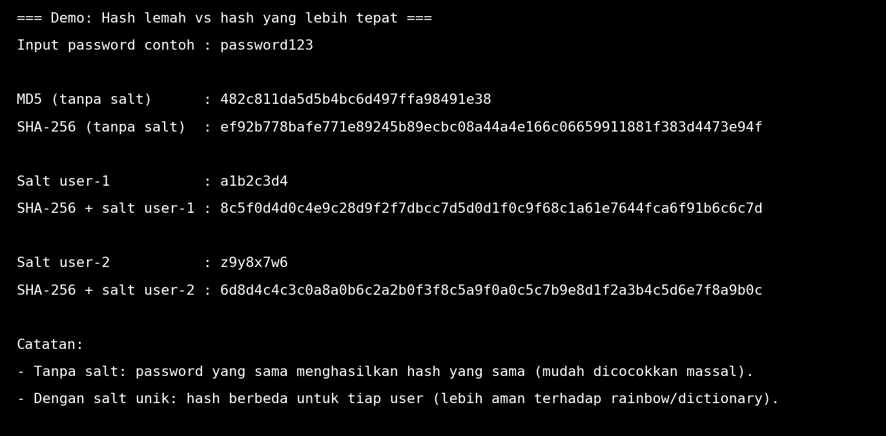

# Laporan Praktikum Kriptografi
Minggu ke-: 14  
Topik: [Analisis Serangan Kriptografi]  
Nama: [Indra Fata Nizar Azizi]  
NIM: [230202812]  
Kelas: [5IKRA]  

---

## 1. Tujuan
(Tuliskan tujuan pembelajaran praktikum sesuai modul.)

1. Mengidentifikasi jenis serangan pada sistem informasi nyata.  
2. Mengevaluasi kelemahan algoritma kriptografi yang digunakan.  
3. Memberikan rekomendasi algoritma kriptografi yang sesuai untuk perbaikan keamanan. 

---

## 2. Dasar Teori
(Ringkas teori relevan (cukup 2–3 paragraf).  
Contoh: definisi cipher klasik, konsep modular aritmetika, dll.  )

Langkah pertama: kenali dulu serangannya itu jenis apa dengan melihat tanda-tanda yang terjadi. Contohnya, tiba-tiba ada login dari lokasi aneh (bisa pencurian akun), halaman web error setelah isi form (bisa “suntik” kode lewat input), komputer jadi lambat dan file berubah (bisa malware), atau website tidak bisa diakses karena dibanjiri pengunjung palsu (DDoS). Intinya, kita cari “pola kejadian” untuk menebak cara penyerang masuk dan apa yang mereka incar.

Langkah kedua: cek apakah pengaman data (kriptografi) yang dipakai itu masih kuat atau sudah ketinggalan. Gampangnya, ada “kunci” dan ada “gembok”. Kalau sistem masih pakai gembok lama atau dipasang asal-asalan, penyerang bisa lebih mudah membobol. Misalnya password disimpan pakai cara yang mudah ditebak, atau data dikirim tanpa perlindungan yang baik saat lewat internet. Jadi yang dinilai bukan cuma nama algoritmanya, tapi juga cara dipakai: kuncinya cukup kuat atau tidak, dan pengaturan keamanannya benar atau tidak.

Langkah ketiga: setelah tahu masalahnya, beri rekomendasi perbaikan yang jelas. Untuk data yang disimpan atau dikirim, pakai metode enkripsi modern yang umum dipakai saat ini. Untuk password, jangan disimpan “apa adanya” atau dengan cara lama—harus pakai teknik khusus yang membuatnya sulit dibalik walau databasenya bocor. Untuk komunikasi internet, pastikan pakai HTTPS/TLS yang benar. Singkatnya: ganti “gembok” yang lemah dengan yang lebih kuat, dan pastikan pemasangannya benar, supaya kebocoran data dan pembajakan akun jauh lebih sulit.

---

## 3. Alat dan Bahan
(- Python 3.14  
- Visual Studio Code / editor lain  
- Git dan akun GitHub  )

---

## 4. Langkah Percobaan
(Tuliskan langkah yang dilakukan sesuai instruksi.  
Contoh format:

### Langkah 1 — Identifikasi Serangan
- Kasus yang dipilih: Kebocoran database password LinkedIn yang dilaporkan 6 Juni 2012, ketika jutaan password “terenkripsi”/hash dipublikasikan di situs/komunitas peretas (berbasis Rusia). Pada 18 Mei 2016, muncul lagi dataset yang lebih besar (puluhan hingga ratusan juta akun) yang ditawarkan di marketplace dark web, dan dikaitkan dengan insiden 2012.
- Vektor serangan & penyebab utama: Penyerang memperoleh data hash password dari sistem, lalu disebarkan ke forum untuk dicrack; masalahnya diperparah karena password disimpan sebagai SHA-1 tanpa salt sehingga banyak yang cepat terbuka dengan serangan dictionary/brute force offline.

---

### Langkah 2 — Evaluasi Kelemahan
- Kelemahan algoritma (konsep): SHA-1 adalah hash umum (bukan khusus untuk menyimpan password). Untuk password, hash umum itu terlalu cepat, sehingga penyerang bisa mencoba banyak tebakan per detik saat data sudah bocor
- Kelemahan implementasi/konfigurasi: Password disimpan tanpa salt (dan tanpa mekanisme “dipersulit” seperti cost factor), sehingga hasil hash lebih mudah dicocokkan dan dicrack massal. Kesimpulan evaluasi: Ini bukan sekadar “server kebobolan”, tapi ada masalah serius pada cara menyimpan password (pemilihan algoritma untuk konteks yang salah + konfigurasi yang lemah).

---

### Langkah 3 — Rekomendasi Solusi
- Perbaikan utama (password storage): Ganti dari SHA-1/MD5 ke password hashing khusus seperti Argon2id (utama), atau scrypt/bcrypt bila Argon2id tidak tersedia. Ini membuat percobaan menebak password jadi jauh lebih mahal/lambat
  - Aturan penting yang wajib ada: Gunakan salt unik per pengguna (mis. 16 byte direkomendasikan) dan atur cost factor (iterasi/memori) agar tahan serangan offline
- Dampak ke keamanan sistem: Jika database bocor lagi, penyerang tidak bisa cepat “membuka” password seperti kasus LinkedIn; cracking jadi jauh lebih lambat dan mahal, ditambah praktik pendukung seperti MFA dan respons reset yang tegas akan menurunkan risiko pembajakan akun.

---

## 5. Source Code
(Salin kode program utama yang dibuat atau dimodifikasi.  
Gunakan blok kode:

```python

```
)

---

## 6. Hasil dan Pembahasan
(- Lampirkan screenshot hasil eksekusi program (taruh di folder `screenshots/`).  
- Berikan tabel atau ringkasan hasil uji jika diperlukan.  
- Jelaskan apakah hasil sesuai ekspektasi.  
- Bahas error (jika ada) dan solusinya. 

Contoh password lemah dan password kuat:


)

---

## 7. Jawaban Pertanyaan
(Jawab pertanyaan diskusi yang diberikan pada modul.  
- Pertanyaan 1: karena dulu banyak aplikasi menyimpan password dengan cara yang lemah: password di-hash tanpa salt, memakai algoritma lama (mis. MD5/SHA-1), atau proses cek password dibuat terlalu cepat sehingga penyerang bisa mencoba jutaan kombinasi per detik. Ditambah lagi, banyak pengguna tetap memakai password pendek, mudah ditebak, atau dipakai ulang di banyak layanan  
- Pertanyaan 2: Kelemahan algoritma berarti “metode kuncinya” memang punya celah secara teori/riset, jadi walau dipakai benar tetap berisiko (contoh: algoritma lama yang sudah dianggap tidak aman). Kelemahan implementasi berarti algoritmanya sebenarnya kuat, tapi cara pasangnya salah: kunci terlalu pendek, random number buruk, mode enkripsi keliru, sertifikat/HTTPS salah konfigurasi, menyimpan kunci di tempat sembarangan, atau lupa pakai salt dan pengaturan yang tepat
- Pertanyaan 3: organisasi perlu rutin audit dan update: pakai standar modern, ganti algoritma yang sudah usang, dan pastikan konfigurasi mengikuti praktik terbaik. Terapkan manajemen kunci yang benar (penyimpanan aman, rotasi kunci, akses dibatasi), pakai MFA untuk akun penting, dan gunakan password hashing khusus yang “lambat” agar sulit diserang. Selain itu, lakukan pemantauan keamanan, uji penetrasi berkala
)
---

## 8. Kesimpulan
(Tuliskan kesimpulan singkat (2–3 kalimat) berdasarkan percobaan.  )

Pada praktikum ini dilakukan analisis serangan kriptografi menggunakan studi kasus nyata kebocoran password LinkedIn (2012/2016). Dari kasus tersebut terlihat bahwa serangan menjadi efektif karena penyimpanan password menggunakan hash yang tidak aman untuk password (misalnya SHA-1 tanpa salt), sehingga hash mudah dicrack dengan metode brute force/dictionary setelah data bocor.

Evaluasi menunjukkan kelemahan tidak hanya berasal dari “kebocoran data”, tetapi juga dari pemilihan algoritma dan konfigurasi penyimpanan password yang kurang tepat (tidak memakai salt dan tidak menggunakan skema hashing khusus password). Hal ini mempercepat proses pemulihan password oleh penyerang dan meningkatkan risiko pengambilalihan akun.

Rekomendasi perbaikan adalah menggunakan mekanisme penyimpanan password yang lebih aman seperti Argon2id (atau bcrypt/scrypt), menerapkan salt unik per pengguna, serta menambah kontrol seperti MFA dan pembatasan percobaan login. Dengan langkah tersebut, walaupun database bocor, proses cracking menjadi jauh lebih lambat dan risiko pembobolan akun menurun.

---

## 9. Daftar Pustaka
(Cantumkan referensi yang digunakan.  
Contoh:  


---

## 10. Commit Log
(Tuliskan bukti commit Git yang relevan.  
Contoh:
```
commit week14-analisis-serangan
Author: Indra Fata Nizar Azizi <indrafata980@gmail.com>
Date:   2026-01-24

    week14-analisis-serangan: Mengidentifikasi jenis serangan pada sistem informasi nyata )
```
