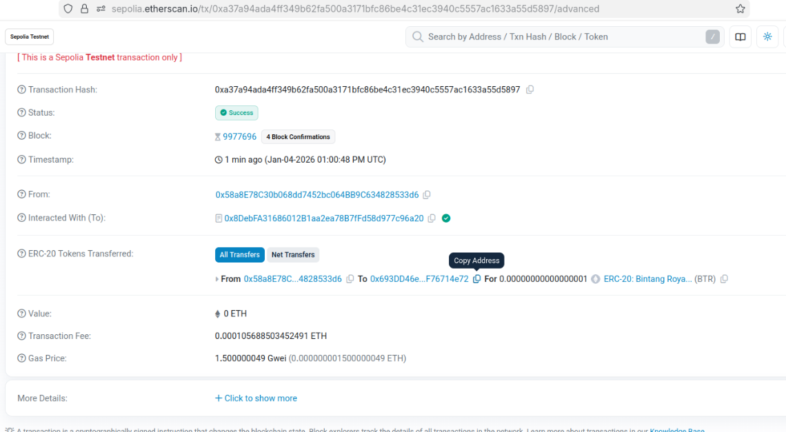

# Laporan Praktikum Kriptografi
Minggu ke-: 15  
Topik: [Proyek Kelompok – TinyCoin ERC20]  
Nama: [Indra Fata Nizar Azizi]  
NIM: [230202812]  
Kelas: [5IKRA]  

---

## 1. Tujuan
(Tuliskan tujuan pembelajaran praktikum sesuai modul.)

1. Mengembangkan proyek sederhana berbasis algoritma kriptografi.  
2. Mendokumentasikan proses implementasi proyek ke dalam repository Git.  
3. Menyusun laporan teknis hasil proyek akhir. 

---

## 2. Dasar Teori
(Ringkas teori relevan (cukup 2–3 paragraf).  
Contoh: definisi cipher klasik, konsep modular aritmetika, dll.  )

Blockchain adalah teknologi pencatatan data berbasis jaringan (distributed ledger) yang menyimpan transaksi secara bersama-sama di banyak node. Karena divalidasi oleh mekanisme konsensus dan diamankan dengan kriptografi, data transaksi menjadi transparan, sulit dipalsukan, dan sangat sulit diubah secara sepihak. Sifat desentralisasi ini mengurangi ketergantungan pada pihak ketiga, sekaligus meningkatkan kepercayaan pada sistem digital seperti pembayaran, pencatatan aset, dan audit transaksi.

Smart contract adalah kode program yang berjalan di jaringan blockchain dan dapat mengeksekusi aturan secara otomatis ketika syarat tertentu terpenuhi. Pada Ethereum dan jaringan yang kompatibel dengan EVM, smart contract umumnya ditulis dengan Solidity. Untuk kebutuhan token fungible, standar ERC-20 menyediakan format token yang konsisten sehingga mudah digunakan lintas ekosistem—mulai dari wallet, DEX, hingga aplikasi Web3—tanpa perlu penyesuaian besar.

Dalam tokenisasi aset, blockchain dan smart contract memungkinkan aset dunia nyata (Real World Assets/RWA) direpresentasikan dalam bentuk token digital. Token ERC-20 dapat dipakai untuk memecah kepemilikan menjadi unit-unit kecil, sehingga aset lebih mudah diperdagangkan, lebih likuid, dan lebih terjangkau bagi investor. Pendekatan ini membuka peluang model bisnis yang lebih efisien dan transparan, termasuk untuk industri kreatif seperti musik—misalnya dalam pembagian hak, distribusi pendapatan, atau kepemilikan fraksional atas karya.

---

## 3. Alat dan Bahan
(-   
- Remix IDE  
- Git dan akun GitHub   )

---

## 4. Langkah Percobaan
(Tuliskan langkah yang dilakukan sesuai instruksi.  
Contoh format:

Langkah 1 — Membuat Kontrak ERC721 (NFT)
kontrak sederhana `TMusicIPNFT.sol`:

```solidity
pragma solidity ^0.8.20;

import "@openzeppelin/contracts/token/ERC721/ERC721.sol";
import "@openzeppelin/contracts/access/Ownable.sol";

contract MusicIPNFT is ERC721, Ownable {
    uint256 public tokenCounter;
    uint256 public requestCounter;

    struct MusicIP {
        string title;
        string artist;
        string metadataURI;
        address creator;
        address royaltyContract;
        bool isActive;
    }

    struct Request {
        uint256 requestId;
        address creator;
        string title;
        string artist;
        string metadataURI;
        address royaltyContract;
        bool hasMinted;
    }

    mapping(uint256 => MusicIP) public musicIPs;
    mapping(uint256 => Request) public requests;

    event MusicIPMinted(uint256 indexed tokenId, address indexed creator, address royaltyContract);
    event RequestSubmitted(uint256 indexed requestId, address indexed creator);
    event RequestApproved(uint256 indexed requestId, uint256 indexed tokenId);

    constructor() ERC721("Music IP NFT", "MIPNFT") Ownable(msg.sender) {}

    function requestListing(
        string calldata _title,
        string calldata _artist,
        string calldata _metadataURI,
        address _royaltyContract
    ) external {
        require(bytes(_metadataURI).length != 0, "metadataURI empty");

        requestCounter++;
        requests[requestCounter] = Request({
            requestId: requestCounter,
            creator: msg.sender,
            title: _title,
            artist: _artist,
            metadataURI: _metadataURI,
            royaltyContract: _royaltyContract,
            hasMinted: false
        });

        emit RequestSubmitted(requestCounter, msg.sender);
    }

    function approveListing(uint256 _requestId) external onlyOwner {
        Request storage req = requests[_requestId];
        require(req.creator != address(0), "Invalid request");
        require(!req.hasMinted, "Already minted");

        uint256 tokenId = ++tokenCounter;
        _safeMint(req.creator, tokenId);

        musicIPs[tokenId] = MusicIP({
            title: req.title,
            artist: req.artist,
            metadataURI: req.metadataURI,
            creator: req.creator,
            royaltyContract: req.royaltyContract,
            isActive: true
        });

        req.hasMinted = true;

        emit MusicIPMinted(tokenId, req.creator, req.royaltyContract);
        emit RequestApproved(_requestId, tokenId);
    }

    function getPendingRequests() external view returns (Request[] memory) {
        uint256 pendingCount = 0;
        for (uint256 i = 1; i <= requestCounter; i++) {
            if (!requests[i].hasMinted) pendingCount++;
        }

        Request[] memory pending = new Request[](pendingCount);
        uint256 index = 0;
        for (uint256 i = 1; i <= requestCounter; i++) {
            if (!requests[i].hasMinted) {
                pending[index] = requests[i];
                index++;
            }
        }
        return pending;
    }

    function mintMusicIP(
        address _creator,
        string calldata _title,
        string calldata _artist,
        string calldata _metadataURI,
        address _royaltyContract
    ) external onlyOwner returns (uint256) {
        require(_creator != address(0), "creator zero");
        require(bytes(_metadataURI).length != 0, "metadataURI empty");

        uint256 tokenId = ++tokenCounter;
        _safeMint(_creator, tokenId);

        musicIPs[tokenId] = MusicIP({
            title: _title,
            artist: _artist,
            metadataURI: _metadataURI,
            creator: _creator,
            royaltyContract: _royaltyContract,
            isActive: true
        });

        emit MusicIPMinted(tokenId, _creator, _royaltyContract);
        return tokenId;
    }

    function tokenURI(uint256 tokenId) public view override returns (string memory) {
        _requireOwned(tokenId);
        return musicIPs[tokenId].metadataURI;
    }

    function getMusicIP(uint256 _tokenId) external view returns (MusicIP memory) {
        _requireOwned(_tokenId);
        return musicIPs[_tokenId];
    }
}

```
### Langkah 2 — Deploy Kontrak
Di Remix:
- Klik Plugin Manager (ikon colokan) → pastikan plugin SOLIDITY aktif
- Kalau import OZ error, biasanya karena environment belum bener. Cara paling aman:
- Pastikan online (Remix fetch library dari npm/github)
- Atau ubah import jadi versi GitHub:
- Ganti 2 baris import ini:
```solidity
import "@openzeppelin/contracts/token/ERC721/ERC721.sol";
import "@openzeppelin/contracts/access/Ownable.sol";
```
jadi
```solidity
import "@openzeppelin/contracts/token/ERC721/ERC721.sol";
import "@openzeppelin/contracts/access/Ownable.sol";
```
### Langkah 3 — Uji Fungsionalitas
- Tab Solidity Compiler
- Pilih compiler 0.8.20
- Centang Auto compile (opsional)
- Klik Compile MusicIPNFT.sol

### Langkah 4 — Dokumentasi
- Tab Deploy & Run Transactions
- Environment: Remix VM (Cancun) (buat test lokal)
- Deploy

---
## 5. Source Code
(Salin kode program utama yang dibuat atau dimodifikasi.  
Gunakan blok kode:

```python
// SPDX-License-Identifier: MIT
pragma solidity ^0.8.20;

import "@openzeppelin/contracts/token/ERC721/ERC721.sol";
import "@openzeppelin/contracts/access/Ownable.sol";

contract MusicIPNFT is ERC721, Ownable {
    uint256 public tokenCounter;
    uint256 public requestCounter;

    struct MusicIP {
        string title;
        string artist;
        string metadataURI;
        address creator;
        address royaltyContract;
        bool isActive;
    }

    struct Request {
        uint256 requestId;
        address creator;
        string title;
        string artist;
        string metadataURI;
        address royaltyContract;
        bool hasMinted;
    }

    mapping(uint256 => MusicIP) public musicIPs;
    mapping(uint256 => Request) public requests;

    event MusicIPMinted(uint256 indexed tokenId, address indexed creator, address royaltyContract);
    event RequestSubmitted(uint256 indexed requestId, address indexed creator);
    event RequestApproved(uint256 indexed requestId, uint256 indexed tokenId);

    constructor() ERC721("Music IP NFT", "MIPNFT") Ownable(msg.sender) {}

    function requestListing(
        string calldata _title,
        string calldata _artist,
        string calldata _metadataURI,
        address _royaltyContract
    ) external {
        require(bytes(_metadataURI).length != 0, "metadataURI empty");

        requestCounter++;
        requests[requestCounter] = Request({
            requestId: requestCounter,
            creator: msg.sender,
            title: _title,
            artist: _artist,
            metadataURI: _metadataURI,
            royaltyContract: _royaltyContract,
            hasMinted: false
        });

        emit RequestSubmitted(requestCounter, msg.sender);
    }

    function approveListing(uint256 _requestId) external onlyOwner {
        Request storage req = requests[_requestId];
        require(req.creator != address(0), "Invalid request");
        require(!req.hasMinted, "Already minted");

        uint256 tokenId = ++tokenCounter;
        _safeMint(req.creator, tokenId);

        musicIPs[tokenId] = MusicIP({
            title: req.title,
            artist: req.artist,
            metadataURI: req.metadataURI,
            creator: req.creator,
            royaltyContract: req.royaltyContract,
            isActive: true
        });

        req.hasMinted = true;

        emit MusicIPMinted(tokenId, req.creator, req.royaltyContract);
        emit RequestApproved(_requestId, tokenId);
    }

    function getPendingRequests() external view returns (Request[] memory) {
        uint256 pendingCount = 0;
        for (uint256 i = 1; i <= requestCounter; i++) {
            if (!requests[i].hasMinted) pendingCount++;
        }

        Request[] memory pending = new Request[](pendingCount);
        uint256 index = 0;
        for (uint256 i = 1; i <= requestCounter; i++) {
            if (!requests[i].hasMinted) {
                pending[index] = requests[i];
                index++;
            }
        }
        return pending;
    }

    function mintMusicIP(
        address _creator,
        string calldata _title,
        string calldata _artist,
        string calldata _metadataURI,
        address _royaltyContract
    ) external onlyOwner returns (uint256) {
        require(_creator != address(0), "creator zero");
        require(bytes(_metadataURI).length != 0, "metadataURI empty");

        uint256 tokenId = ++tokenCounter;
        _safeMint(_creator, tokenId);

        musicIPs[tokenId] = MusicIP({
            title: _title,
            artist: _artist,
            metadataURI: _metadataURI,
            creator: _creator,
            royaltyContract: _royaltyContract,
            isActive: true
        });

        emit MusicIPMinted(tokenId, _creator, _royaltyContract);
        return tokenId;
    }

    function tokenURI(uint256 tokenId) public view override returns (string memory) {
        _requireOwned(tokenId);
        return musicIPs[tokenId].metadataURI;
    }

    function getMusicIP(uint256 _tokenId) external view returns (MusicIP memory) {
        _requireOwned(_tokenId);
        return musicIPs[_tokenId];
    }
}

```
)

---

## 6. Hasil dan Pembahasan
(- Lampirkan screenshot hasil eksekusi program (taruh di folder `screenshots/`).  
- Berikan tabel atau ringkasan hasil uji jika diperlukan.  
- Jelaskan apakah hasil sesuai ekspektasi.  
- Bahas error (jika ada) dan solusinya. 

Hasil eksekusi :



)

---

## 7. Jawaban Pertanyaan
(Jawab pertanyaan diskusi yang diberikan pada modul.  
- Pertanyaan 1: ERC-20 berfungsi sebagai standar token fungible di ekosistem blockchain berbasis EVM sehingga token dapat dikenali dan digunakan secara konsisten oleh wallet, exchange, DEX, dan dApp tanpa perlu integrasi khusus untuk tiap proyek. Dengan adanya standar ini, token memiliki “aturan main” yang sama—misalnya cara mengecek saldo, total suplai, dan melakukan transfer—yang membuat interoperabilitas meningkat dan pengembangan aplikasi Web3 menjadi lebih mudah, cepat, dan minim kesalahan integrasi.  
- Pertanyaan 2: Mekanisme transfer token pada ERC-20 umumnya berjalan melalui dua cara. Pertama, transfer langsung menggunakan fungsi transfer, di mana pemilik token mengirim sejumlah token ke alamat tujuan; kontrak akan memverifikasi saldo pengirim cukup, mengurangi saldo pengirim, menambah saldo penerima, lalu memancarkan event Transfer sebagai bukti pencatatan transaksi. Kedua, transfer melalui pihak ketiga menggunakan skema allowance, di mana pemilik token memberi izin kepada “spender” melalui approve agar spender dapat memindahkan token atas nama pemilik; kemudian spender memanggil transferFrom, kontrak memeriksa apakah izin (allowance) dan saldo pemilik mencukupi, mengurangi allowance dan saldo pemilik, menambah saldo penerima, lalu memancarkan event Transfer (serta Approval saat izin diberikan).
- Pertanyaan 3: Risiko utama dalam implementasi smart contract biasanya berasal dari bug logika dan kontrol akses yang keliru, kerentanan reentrancy akibat pemanggilan eksternal yang tidak aman, kesalahan perhitungan (overflow/underflow, pembulatan, dan penanganan desimal), serangan front-running/MEV pada transaksi yang sensitif, serta penyalahgunaan allowance ketika pengguna memberi izin besar kepada kontrak yang tidak tepercaya. Mitigasinya dilakukan dengan menerapkan pola kontrol akses yang ketat (misalnya role/owner), mengikuti prinsip Checks-Effects-Interactions dan/atau memakai ReentrancyGuard, menggunakan library yang tepercaya seperti OpenZeppelin, menambah pengujian menyeluruh termasuk edge case dan fuzz testing, melakukan audit keamanan serta analisis statis, membatasi dan mengelola allowance secara aman (misalnya increase/decrease allowance), dan bila menggunakan upgradeability, menerapkan multisig serta timelock agar perubahan kontrak tidak bisa dilakukan sembarangan.  
)
---

## 8. Kesimpulan
(Tuliskan kesimpulan singkat (2–3 kalimat) berdasarkan percobaan.  )

Pada praktikum ini telah dibuat dan diuji smart contract token berbasis standar (ERC) menggunakan Solidity di Remix, serta didokumentasikan ke repository GitHub. Hasil pengujian menunjukkan fungsi inti berjalan sesuai tujuan (pembuatan aset/token dan pengelolaan data/metadata), dengan pembatasan akses tertentu untuk menjaga kontrol saat proses minting/approval. Dari proses ini dapat disimpulkan bahwa penggunaan standar ERC dan library OpenZeppelin mempermudah implementasi sekaligus mengurangi risiko bug keamanan dasar, selama konfigurasi compiler, deployment, dan dokumentasi dilakukan dengan benar.

---

## 9. Daftar Pustaka
(Cantumkan referensi yang digunakan.  
Contoh:  

---

## 10. Commit Log
(Tuliskan bukti commit Git yang relevan.  
Contoh:
```
commit week15-tinycoin-erc20
Author: Indra Fata Nizar Azizi <indrafata980@gmail.com>
Date:   2026-01-26

    week15-tinycoin-erc20:  )
```
