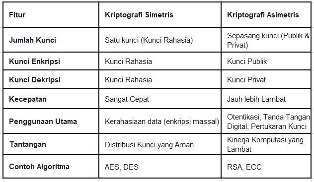
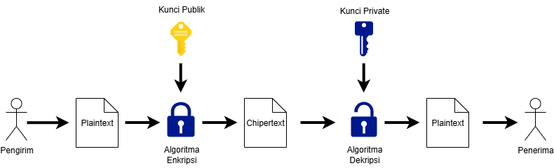
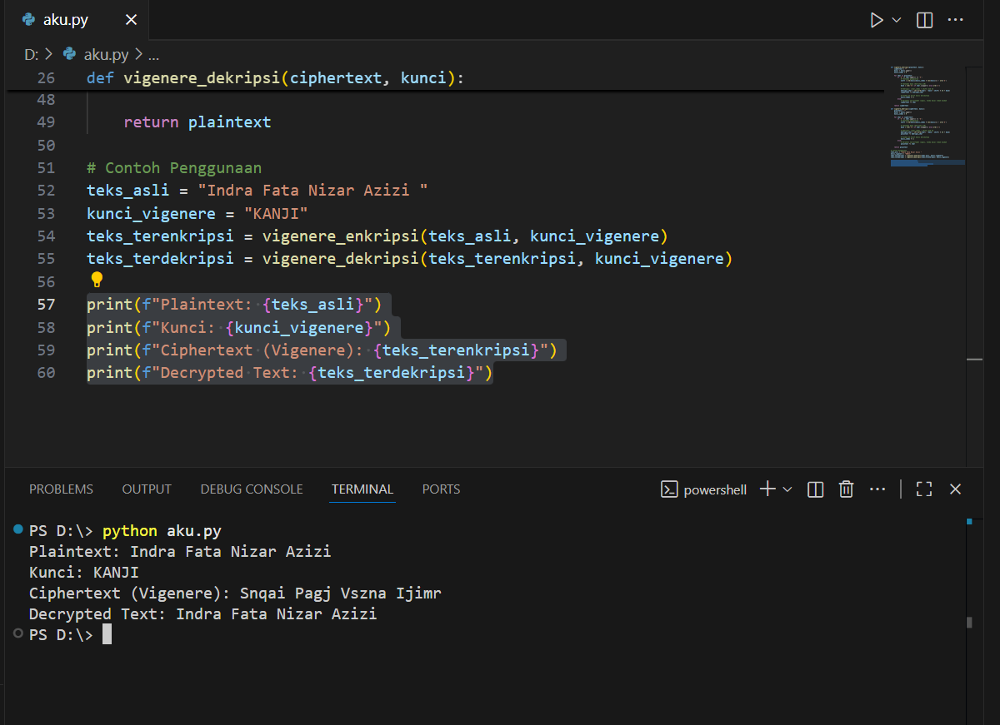

# Laporan Praktikum Kriptografi

Minggu ke-: 2  
Topik: cryptosystem    
Nama: Indra Fata Nizar Azizi   
NIM: 230202812  
Kelas: 5IKRA  

---

## 1. Tujuan
(Tuliskan tujuan pembelajaran praktikum sesuai modul.)
1. Mengidentifikasi komponen dasar kriptosistem (plaintext, ciphertext, kunci, algoritma).
2. Menggambarkan proses enkripsi dan dekripsi sederhana.
3. Mengklasifikasikan jenis kriptosistem (simetris dan asimetris).

---

## 2. Dasar Teori
Kriptografi simetris, atau secret-key cryptography, menggunakan satu kunci rahasia yang sama untuk mengenkripsi dan mendekripsi data. Metode ini sangat cepat dan efisien sehingga ideal untuk enkripsi data dalam volume besar. Namun, tantangan terbesarnya adalah distribusi kunci, di mana kunci rahasia harus dibagikan kepada penerima melalui saluran yang aman sebelum komunikasi dimulai. Contoh algoritmanya adalah AES (Advanced Encryption Standard)dan DES (Data Encryption Standard)

Kriptografi asimetris, atau public-key cryptography, mengatasi masalah distribusi kunci dengan menggunakan sepasang kunci yang saling terkait secara matematis: kunci publik dan kunci privat. Kunci publik dapat disebarkan secara bebas untuk mengenkripsi pesan, namun hanya kunci privat pasangannya (yang hanya dimiliki oleh penerima) yang dapat mendekripsinya. Metode ini secara inheren lebih aman dalam hal pertukaran kunci dan juga memungkinkan fungsi tanda tangan digital dan otentikasi. Kelemahannya adalah prosesnya jauh lebih lambat dan membutuhkan daya komputasi yang lebih besar. Contoh algoritmanya adalah RSA (Rivest–Shamir–Adleman) dan ECC (Elliptic Curve Cryptography).



---

## 3. Alat dan Bahan
- Python 3.14.0  
- Visual Studio Code
- Git dan akun GitHub  

---

## 4. Langkah Percobaan
Langkah 1 — Membuat Skema Kriptosistem
- Buat diagram sederhana (pakai draw.io)
- Simpan diagram di folder `screenshots/diagram_kriptosistem.png`.  
- Lampirkan ke laporan
  
Langkah 2 — Implementasi Program Sederhana
- Tulis program Python untuk simulasi enkripsi & dekripsi menggunakan substitusi sederhana menggunakan vigenere

Langkah 3 — Klasifikasi Simetris & Asimetris

- Tambahkan penjelasan di laporan mengenai perbedaan kriptografi simetris dan asimetris.
- Sertakan minimal 1 contoh algoritma dari masing-masing:
  - Simetris → AES, DES  
  - Asimetris → RSA, ECC  

---

## 5. Source Code
(Salin kode program utama yang dibuat atau dimodifikasi.  
Gunakan blok kode:

```python
def vigenere_enkripsi(plaintext, kunci):
    ciphertext = ""
    kunci = kunci.upper()
    kunci_index = 0
    
    for char in plaintext:
        if 'A' <= char.upper() <= 'Z':
            # Tentukan pergeseran
            shift = ord(kunci[kunci_index % len(kunci)]) - ord('A')
            
            # Tentukan base (A=0 atau a=0)
            base = ord('A') if char.isupper() else ord('a')
            
            # Enkripsi: (char_index + shift) mod 26
            enkripsi_char = chr((ord(char) - base + shift) % 26 + base)
            ciphertext += enkripsi_char
            
            # Pindah ke huruf kunci berikutnya
            kunci_index += 1
        else:
            # Karakter non-alfabet (spasi, tanda baca) tidak diubah
            ciphertext += char
            
    return ciphertext

def vigenere_dekripsi(ciphertext, kunci):
    plaintext = ""
    kunci = kunci.upper()
    kunci_index = 0
    
    for char in ciphertext:
        if 'A' <= char.upper() <= 'Z':
            # Tentukan pergeseran
            shift = ord(kunci[kunci_index % len(kunci)]) - ord('A')
            
            # Tentukan base (A=0 atau a=0)
            base = ord('A') if char.isupper() else ord('a')
            
            # Dekripsi: (char_index - shift) mod 26
            dekripsi_char = chr((ord(char) - base - shift) % 26 + base)
            plaintext += dekripsi_char
            
            # Pindah ke huruf kunci berikutnya
            kunci_index += 1
        else:
            # Karakter non-alfabet (spasi, tanda baca) tidak diubah
            plaintext += char
            
    return plaintext

# Contoh Penggunaan
teks_asli = "pesan"
kunci_vigenere = "kunci"
teks_terenkripsi = vigenere_enkripsi(teks_asli, kunci_vigenere)
teks_terdekripsi = vigenere_dekripsi(teks_terenkripsi, kunci_vigenere)

print(f"Plaintext: {teks_asli}")
print(f"Kunci: {kunci_vigenere}")
print(f"Ciphertext (Vigenere): {teks_terenkripsi}")
print(f"Decrypted Text: {teks_terdekripsi}")
```
)

Ekspektasi keluaran:  
```
Plaintext : Indra Fata Nizar Azizi
Ciphertext: Snqai Pagj Vszna Ijimr
Decrypted : Indra Fata Nizar Azizi
```

---

## 6. Hasil dan Pembahasan
(- Lampirkan screenshot hasil eksekusi program (taruh di folder `screenshots/`).  
- Berikan tabel atau ringkasan hasil uji jika diperlukan.  
- Jelaskan apakah hasil sesuai ekspektasi.  
- Bahas error (jika ada) dan solusinya. 

Diagram/skema kriptosistem dasar:


Hasil eksekusi program vigenere:

)

---

## 7. Jawaban Pertanyaan
(Jawab pertanyaan diskusi yang diberikan pada modul.  
- Pertanyaan 1: plaintext,chipertext,algoritma enkripsi,algoritma dekripsi,key
- Pertanyaan 2: Keunggulan dari symmetric key cryptography adalah proses enkripsi dan dekripsinya relatif cepat dibandingkan dengan jenis
kriptografi lainnya. Namun, kekurangan dari metode ini adalah distribusi kunci yang aman dikarenakan kriptografi simetris memiliki
kunci enkripsi dan dekripsi yang sama maka penggunaan kriptografi simetris rentan terhadap kebocoran apabila si penyadap mengetahui kuncinya.
- Pertanyaan 3: karena saat distribusi kunci terdapat Penyadap (eavesdropper), penyadap adalah orang yang mencoba menangkap pesan selama
ditransmisikan. Tujuan penyadap adalah untuk mendapatkan informasi sebanyakbanyaknya mengenai sistem kriptografi yang digunakan untuk berkomunikasi
dengan maksud untuk memecahkan cipherteks dikarenakan kriptografi simetris memiliki kunci enkripsi dan dekripsi yang sama maka penggunaan
kriptografi simetris rentan terhadap kebocoran apabila si penyadap mengetahui kuncinya.
)
---

## 8. Kesimpulan
(Tuliskan kesimpulan singkat (2–3 kalimat) berdasarkan percobaan.)

Praktikum ini berhasil mengidentifikasi komponen dasar kriptosistem dan menyimulasikan proses enkripsi-dekripsi sederhana menggunakan Vigenere Cipher, yang merupakan contoh dari kriptografi simetris. Perbedaan utama antara kriptografi simetris (cepat, satu kunci, masalah distribusi) dan asimetris (lambat, pasangan kunci, unggul dalam otentikasi) berhasil diklasifikasikan, menegaskan bahwa pemilihan jenis kriptografi harus disesuaikan dengan kebutuhan kecepatan dan keamanan pertukaran kunci.

---

## 9. Daftar Pustaka
(Cantumkan referensi yang digunakan.  
Contoh:  
- Katz, J., & Lindell, Y. *Introduction to Modern Cryptography*.  
- Stallings, W. *Cryptography and Network Security*.  )

---

## 10. Commit Log
(Tuliskan bukti commit Git yang relevan.  
Contoh:
```
02_cryptosystem
Author: Nama Mahasiswa <email>
Date:   2025-09-20

    week2-cryptosystem: implementasi Caesar Cipher dan laporan )
```
