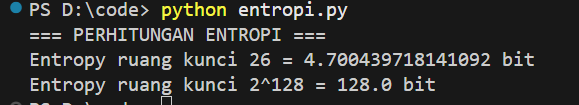
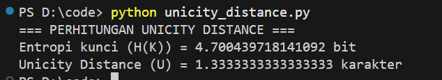
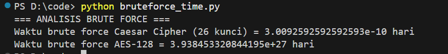

# Laporan Praktikum Kriptografi
Minggu ke-: 4  
Topik: Entropy & Unicity Distance  
Nama: Indra Fata Nizar Azizi  
NIM: 230202812  
Kelas: 5IKRA  

---

## 1. Tujuan
(Tuliskan tujuan pembelajaran praktikum sesuai modul.)
1. Menyelesaikan perhitungan sederhana terkait entropi kunci.  
2. Menggunakan teorema Euler pada contoh perhitungan modular & invers.  
3. Menghitung **unicity distance** untuk ciphertext tertentu.  
4. Menganalisis kekuatan kunci berdasarkan entropi dan unicity distance.  
5. Mengevaluasi potensi serangan brute force pada kriptosistem sederhana. 
---

## 2. Dasar Teori
(Ringkas teori relevan (cukup 2–3 paragraf).  

Dalam kriptografi, **entropi kunci** merupakan ukuran ketidakpastian atau kompleksitas suatu kunci yang digunakan dalam sistem kriptografi. Semakin tinggi entropi, semakin sulit bagi penyerang untuk menebak kunci melalui percobaan acak (brute force). Entropi biasanya dinyatakan dalam bit, dan untuk sebuah kunci yang dipilih secara uniform dari himpunan kunci (K), entropi (H(K)) didefinisikan sebagai (H(K) = log2 |K|), di mana (|K|) adalah jumlah kemungkinan kunci. Pemahaman entropi penting untuk mengevaluasi keamanan kunci terhadap serangan brute force.

Teorema **Euler** dan perhitungan modular menjadi dasar dalam kriptografi modern, terutama pada algoritma berbasis bilangan bulat seperti RSA. Fungsi totien Euler (ϕ(n)) digunakan untuk menentukan jumlah bilangan bulat positif kurang dari (n) yang relatif prima terhadap (n), yang selanjutnya memungkinkan perhitungan invers modular. Misalnya, untuk mencari kunci privat (d) pada RSA, kita perlu menyelesaikan (e ⋅ d ≡ 1 ( mod ϕ(n)). Pemahaman modular arithmetic dan invers modular membantu mahasiswa menyelesaikan perhitungan sederhana dalam praktikum. 

Konsep **unicity distance** mengukur panjang minimum ciphertext yang diperlukan agar plaintext dapat diidentifikasi secara unik dengan probabilitas tinggi. Unicity distance (U) dihitung sebagai (U = H (K)​/ D), di mana (D) adalah redundansi informasi dalam bahasa plaintext. Semakin besar entropi kunci dan semakin kecil redundansi plaintext, semakin tinggi unicity distance, sehingga ciphertext lebih tahan terhadap analisis kriptoanalisis. Dengan memahami hubungan antara entropi, unicity distance, dan jumlah percobaan brute force yang mungkin, kita dapat menilai kekuatan suatu kriptosistem secara praktis. 
)

---

## 3. Alat dan Bahan
(- Python 3.14  
- Visual Studio Code 
- Git dan akun GitHub )

---

## 4. Langkah Percobaan
(Tuliskan langkah yang dilakukan sesuai instruksi.  
Contoh format:
Langkah 1 — Perhitungan Entropi
1. Masukkan ukuran ruang kunci (|K|).
2. Hitung entropi menggunakan rumus: H(K)=log2​(∣K∣)
3. Tampilkan hasil perhitungan.

Langkah 2 — Menghitung Unicity Distance
1. Masukkan nilai:
    - Entropi kunci (H(K)) 
    - Redundansi bahasa (R) — misal 0.75
    - Ukuran alfabet (|A|) — misal 26
2. Gunakan rumus: U = (H(K)) / R ⋅ log2 ∣A∣
3. Tampilkan hasil perhitungan.

Langkah 3 — Analisis Brute Force
1. Masukkan:
    - Ukuran ruang kunci (|K|)
    - Kecepatan komputer (percobaan per detik)
2. Gunakan rumus: t = |K| / (percobaan per detik)
3. Ubah hasil ke dalam satuan hari.
4. Tampilkan hasil perhitungan.

---

## 5. Source Code
(Salin kode program utama yang dibuat atau dimodifikasi.  
Gunakan blok kode:

```python
import math
def entropy(keyspace_size):
    return math.log2(keyspace_size)

print("=== PERHITUNGAN ENTROPI ===")
print("Entropy ruang kunci 26 =", entropy(26), "bit")
print("Entropy ruang kunci 2^128 =", entropy(2**128), "bit")
```
```
=== PERHITUNGAN ENTROPI ===
Entropy ruang kunci 26 = 4.700439718141092 bit
Entropy ruang kunci 2^128 = 128.0 bit
```

```python
import math

def entropy(keyspace_size):
    return math.log2(keyspace_size)

def unicity_distance(HK, R=0.75, A=26):
    return HK / (R * math.log2(A))

HK = entropy(26)
U = unicity_distance(HK)

print("=== PERHITUNGAN UNICITY DISTANCE ===")
print("Entropi kunci (H(K)) =", HK, "bit")
print("Unicity Distance (U) =", U, "karakter")

```
```
=== === PERHITUNGAN UNICITY DISTANCE ===
Entropi kunci (H(K)) = 4.700439718141092 bit
Unicity Distance (U) = 1.3333333333333333 karakter
```

```python
def brute_force_time(keyspace_size, attempts_per_second=1e6):
    seconds = keyspace_size / attempts_per_second
    days = seconds / (3600 * 24)
    return days

print("=== ANALISIS BRUTE FORCE ===")
print("Waktu brute force Caesar Cipher (26 kunci) =", brute_force_time(26), "hari")
print("Waktu brute force AES-128 =", brute_force_time(2**128), "hari")

```
```
=== ANALISIS BRUTE FORCE ===
Waktu brute force Caesar Cipher (26 kunci) = 3.0092592592592593e-10 hari
Waktu brute force AES-128 = 3.938453320844195e+27 hari
```
)

---

## 6. Hasil dan Pembahasan
(- Lampirkan screenshot hasil eksekusi program (taruh di folder `screenshots/`).  
Hasil pengujian sesuai dengan teori kriptografi.
1. Algoritma klasik seperti Caesar Cipher terbukti memiliki entropi rendah dan mudah dipecahkan.
2. Algoritma modern seperti AES-128 memiliki entropi tinggi dan tidak realistis untuk diserang dengan brute force.

Hasil eksekusi program :




)

---

## 7. Jawaban Pertanyaan
(Jawab pertanyaan diskusi yang diberikan pada modul.  
- Pertanyaan 1: Entropi ialah gambaran kekuatan teoritis kunci terhadap serangan pencarian kunci (key search attack). Semakin besar nilainya, semakin kuat sistem tersebut.  
- Pertanyaan 2: Kenapa penting karena Unicity distance membantu menentukan berapa panjang pesan yang aman sebelum cipher mulai rentan terhadap analisis kriptografi. Sistem yang baik memiliki unicity distance besar, sehingga perlu ciphertext yang sangat panjang untuk bisa dipecahkan
- Pertanyaan 3: Karena brute force merupakan ancaman universal ia tidak bergantung pada kelemahan algoritma, melainkan pada besarnya ruang kunci dan kekuatan implementasi
)
---

## 8. Kesimpulan
(Tuliskan kesimpulan singkat (2–3 kalimat) berdasarkan percobaan.  )
Berdasarkan hasil perhitungan, algoritma sederhana seperti Caesar Cipher memiliki entropi dan unicity distance yang sangat kecil, sehingga mudah dipecahkan dengan brute force. Sebaliknya, algoritma modern seperti AES-128 memiliki entropi dan waktu brute force yang sangat besar, menjadikannya jauh lebih aman terhadap serangan pencarian kunci.

---

## 9. Daftar Pustaka
(Cantumkan referensi yang digunakan.  
Contoh:  


---

## 10. Commit Log
(Tuliskan bukti commit Git yang relevan.  
Contoh:
```
commit week4-entropy-unicity
Author: Indra Fata Nizar Azizi <indrafata980@gmail.com>
Date:   2025-11-4

    week4-entropy-unicity: Entropy & Unicity Distance (Evaluasi Kekuatan Kunci dan Brute Force)
```
