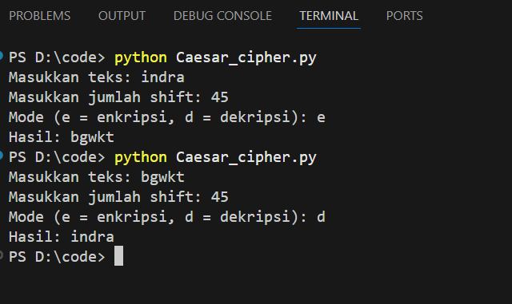
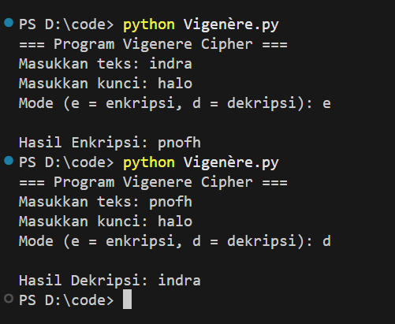
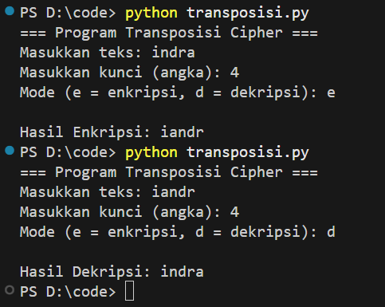

# Laporan Praktikum Kriptografi
Minggu ke-: 5  
Topik: Cipher Klasik (Caesar, Vigenère, Transposisi)  
Nama: Indra Fata Nizar Azizi  
NIM: 230202812    
Kelas: 5IKRA    

---

## 1. Tujuan
(Tuliskan tujuan pembelajaran praktikum sesuai modul.)
1. Menerapkan algoritma **Caesar Cipher** untuk enkripsi dan dekripsi teks.  
2. Menerapkan algoritma **Vigenère Cipher** dengan variasi kunci.  
3. Mengimplementasikan algoritma transposisi sederhana.  
4. Menjelaskan kelemahan algoritma kriptografi klasik.  
---

## 2. Dasar Teori
(Ringkas teori relevan (cukup 2–3 paragraf).  
Contoh: definisi cipher klasik, konsep modular aritmetika, dll.  )
Cipher klasik merupakan metode kriptografi yang digunakan untuk menyandikan pesan agar tidak dapat dibaca oleh pihak yang tidak berwenang. Salah satu metode paling sederhana adalah Caesar Cipher, yang mengenkripsi teks dengan menggeser setiap huruf sejumlah posisi tertentu dalam alfabet. Misalnya, dengan pergeseran 3, huruf 'A' menjadi 'D'. Dekripsinya hanya dengan menggeser huruf kembali ke posisi semula. Caesar Cipher mudah dipahami dan diimplementasikan, tetapi sangat rentan terhadap serangan analisis frekuensi karena pola huruf dalam bahasa tetap terlihat.

Vigenère Cipher adalah pengembangan dari Caesar Cipher dengan menggunakan kunci kata yang lebih panjang dan berulang untuk menentukan pergeseran setiap huruf. Hal ini membuat pola lebih kompleks dan meningkatkan keamanan dibanding Caesar Cipher. Misalnya, kunci “LEMON” digunakan untuk mengenkripsi teks “ATTACK”, di mana setiap huruf teks digeser sesuai huruf kunci. Meski lebih aman, Vigenère tetap memiliki kelemahan jika kunci pendek atau dapat ditebak, karena pola pergeseran bisa dianalisis dengan metode Kasiski atau analisis frekuensi.

Cipher transposisi berbeda dengan Caesar dan Vigenère karena tidak mengubah huruf, melainkan menyusun ulang posisi huruf sesuai aturan tertentu, seperti baris-ke-kolom (rail fence) atau pengurutan kolom berdasarkan kunci. Metode ini menjaga frekuensi huruf asli, tetapi pesan dapat dipulihkan jika pola transposisi diketahui. Secara umum, kelemahan utama cipher klasik adalah mudah diretas dengan analisis frekuensi dan pola, serta tidak cukup aman untuk komunikasi modern yang memerlukan keamanan tinggi.

---

## 3. Alat dan Bahan
(- Python 3.14  
- Visual Studio Code / editor lain  
- Git dan akun GitHub  )

---

## 4. Langkah Percobaan
(Tuliskan langkah yang dilakukan sesuai instruksi.  
Contoh format:
## 🧩 Langkah 1 — Implementasi Caesar Cipher

**File:** `Caesar_cipher.py`

### Langkah-langkah:

1. Mulai program `Caesar_cipher.py`.
2. Minta pengguna memasukkan:
   - **Teks** yang akan dienkripsi atau didekripsi  
   - **Nilai shift** (pergeseran huruf)  
   - **Mode** (`e` untuk enkripsi, `d` untuk dekripsi)
3. Jika `mode = d`, ubah shift menjadi negatif.
4. Buat variabel kosong bernama `hasil`.
5. Untuk setiap karakter dalam teks:
   - Jika huruf alfabet:
     - Tentukan nilai dasar (`'A'` atau `'a'`).
     - Geser posisi huruf dengan rumus:  
       `(kode_huruf + shift) mod 26`
     - Ubah kembali ke huruf.
   - Jika bukan huruf, tambahkan langsung ke hasil tanpa perubahan.
6. Tampilkan hasil enkripsi atau dekripsi.
7. **Selesai.**

---

## 🔑 Langkah 2 — Implementasi Vigenère Cipher

**File:** `Vigenere.py`

### Langkah-langkah:

1. Mulai program `Vigenere.py`.
2. Minta pengguna memasukkan:
   - **Teks** yang akan dienkripsi atau didekripsi  
   - **Kunci (key)**  
   - **Mode** (`e` untuk enkripsi, `d` untuk dekripsi)
3. Ubah semua huruf kunci menjadi huruf kapital.
4. Buat variabel kosong bernama `hasil`.
5. Untuk setiap karakter dalam teks:
   - Jika huruf alfabet:
     - Tentukan nilai **shift** berdasarkan huruf kunci:  
       `shift = (kode huruf kunci) - 'A'`
     - Geser huruf teks dengan rumus:  
       `(kode huruf + shift) mod 26`
     - Tambahkan hasil ke `ciphertext`.
     - Pindah ke huruf kunci berikutnya.
   - Jika bukan huruf, tambahkan langsung tanpa perubahan.
6. Tampilkan hasil enkripsi atau dekripsi.
7. **Selesai.**

---

## 🔄 Langkah 3 — Implementasi Transposisi Cipher Sederhana

**File:** `transposisi.py`

### Langkah-langkah:

1. Mulai program `transposisi.py`.
2. Minta pengguna memasukkan:
   - **Teks** yang akan dienkripsi atau didekripsi  
   - **Kunci (key)**  
   - **Mode** (`e` untuk enkripsi, `d` untuk dekripsi)
3. Buat daftar kosong `ciphertext` dengan panjang sebanyak `kunci`.
4. Untuk setiap kolom dari `0` hingga `kunci - 1`:
   - Ambil huruf dari plaintext mulai dari posisi kolom tersebut.
   - Lewati huruf setiap `kunci` langkah  
     (misalnya setiap 3 huruf jika `kunci = 3`).
   - Simpan huruf-huruf tersebut ke dalam `ciphertext[col]`.
5. Gabungkan semua elemen `ciphertext` menjadi satu string.
6. Hasilnya adalah teks terenkripsi (`ciphertext`).
7. Tampilkan hasil enkripsi atau dekripsi.
8. **Selesai.**
---

## 5. Source Code
(Salin kode program utama yang dibuat atau dimodifikasi.  
Gunakan blok kode:

```python
# contoh potongan kode
def encrypt(text, key):
    return ...
```
)

---

## 6. Hasil dan Pembahasan
(- Lampirkan screenshot hasil eksekusi program (taruh di folder `screenshots/`).  
 
Hasil eksekusi program Caesar Cipher:



Hasil eksekusi program vignere Cipher:



Hasil eksekusi program transposisi:


)

---

## 7. Jawaban Pertanyaan
(Jawab pertanyaan diskusi yang diberikan pada modul.  
- Pertanyaan 1:
  Kelemahan utama Caesar Cipher
  - Hanya ada 25 kemungkinan kunci
  - Huruf yang sama pada plaintext selalu dienkripsi menjadi huruf yang sama, sehingga pola seperti pengulangan kata mudah        dikenali.
  - Rentan terhadap analisis frekuensi
  Kelemahan utama Vigenère Cipher
  - Kalau panjang kunci pendek, pola enkripsi berulang dan bisa ditemukan lewat Kasiski examination atau Friedman test.
  - Bisa diserang analisis frekuensi kelompok, setelah tahu panjang kunci, tiap posisi huruf bisa dianalisis
  - Mudah dipecahkan dengan program brute force untuk kunci pendek.
- Pertanyaan 2:Cipher klasik mudah diserang karena tidak menyembunyikan distribusi huruf dan tidak menghilangkan pola bahasa.
- Pertanyaan 3:
Cipher Substitusi (Substitution Cipher)
Kelebihan
-Mudah dipahami dan diterapkan
-Cepat dalam enkripsi/dekripsi
-Bisa menghasilkan ciphertext yang terlihat acak
Kelemahan
-Rentan terhadap analisis frekuensi
-Polanya tetap
-Kunci sering mudah ditebak
Cipher Transposisi (Transposition Cipher)
-Tidak dapat dianalisis dengan frekuensi huruf
-Lebih sulit ditebak strukturnya
-Dapat digabung dengan substitusi
Kelemahan
-Masih bisa diserang dengan analisis pola posisi
-Perlu pengaturan posisi atau grid
-Tidak mengubah huruf sama sekali
)
--- 

## 8. Kesimpulan
(Tuliskan kesimpulan singkat (2–3 kalimat) berdasarkan percobaan.  )

---

## 9. Daftar Pustaka
(Cantumkan referensi yang digunakan.  
Contoh:  
- Katz, J., & Lindell, Y. *Introduction to Modern Cryptography*.  
- Stallings, W. *Cryptography and Network Security*.  )

---

## 10. Commit Log
(Tuliskan bukti commit Git yang relevan.  
Contoh:
```
commit week5-cipher-klasik
Author: Indra Fata Nizar Azizi <indrafata980@gmail.com>
Date:   2025-11-04

    week5-cryptosystem: Cipher Klasik (Caesar, Vigenère, Transposisi)  
```
