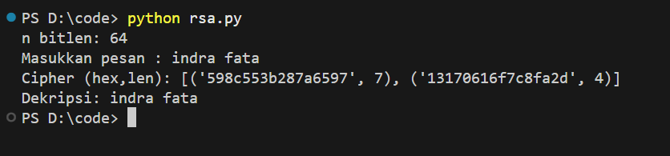

# Laporan Praktikum Kriptografi
Minggu ke-: 6  
Topik: Cipher Modern (DES, AES, RSA)  
Nama: Indra Fata Nizar Azizi  
NIM: 230202812  
Kelas: 5ikra  

---

## 1. Tujuan
(Tuliskan tujuan pembelajaran praktikum sesuai modul.)
Setelah mengikuti praktikum ini, mahasiswa diharapkan mampu:  
1. Mengimplementasikan algoritma **DES** untuk blok data sederhana.  
2. Menerapkan algoritma **AES** dengan panjang kunci 128 bit.  
3. Menjelaskan proses pembangkitan kunci publik dan privat pada algoritma **RSA**.
---

## 2. Dasar Teori
(Ringkas teori relevan (cukup 2–3 paragraf).  
Contoh: definisi cipher klasik, konsep modular aritmetika, dll.  )

DES (Data Encryption Standard) adalah algoritma enkripsi simetris block cipher yang dikembangkan pada tahun 1970-an dan menjadi standar federal AS, DES menggunakan kunci 56-bit dan memproses data dalam blok 64-bit melalui 16 putaran struktur Feistel yang melibatkan permutasi, substitusi, dan operasi XOR. Kelemahan utama DES terletak pada panjang kuncinya yang terlalu pendek untuk standar keamanan modern, membuatnya rentan terhadap serangan brute force. Untuk mengatasi ini, dikembangkan Triple DES (3DES) yang menerapkan DES tiga kali secara berurutan, namun solusi ini mengorbankan efisiensi komputasi.

AES (Advanced Encryption Standard) menggantikan DES sebagai standar enkripsi sejak 2001 setelah melalui kompetisi yang ketat. AES adalah algoritma simetris berbasis substitution-permutation network (SPN) yang bekerja pada blok 128-bit dengan variasi panjang kunci 128, 192, atau 256-bit. Setiap putaran AES (10/12/14 putaran tergantung panjang kunci) melakukan transformasi SubBytes menggunakan S-box, ShiftRows untuk permutasi baris, MixColumns untuk difusi pada kolom state, dan AddRoundKey untuk kombinasi dengan kunci putaran. AES unggul dalam efisiensi implementasi hardware dan software, serta memiliki fondasi matematis yang kuat dalam teori finite field (Galois Field), menjadikannya standar enkripsi global yang digunakan dalam berbagai aplikasi termasuk protokol blockchain.

RSA (Rivest-Shamir-Adleman) adalah algoritma kriptografi kunci publik fundamental yang keamanannya bergantung pada kesulitan komputasi masalah faktorisasi bilangan bulat besar. RSA menggunakan pasangan kunci asimetris: kunci publik (n, e) untuk enkripsi dan kunci privat (n, d) untuk dekripsi, di mana n adalah hasil perkalian dua bilangan prima besar. RSA bersama dengan algoritma kunci publik lainnya (seperti ECDSA) menjadi fondasi untuk digital signatures dan manajemen identitas dalam sistem blockchain. Meskipun RSA lebih lambat dibanding enkripsi simetris, perannya krusial dalam key exchange protocols, digital signatures, dan Public Key Infrastructure (PKI) yang juga diterapkan dalam smart contract security seperti yang didokumentasikan dalam Ethereum & Solidity Documentation.

---

## 3. Alat dan Bahan
(- Python 3.14  
- Visual Studio Code / editor lain  
- Git dan akun GitHub  
- Library tambahan pycryptodome, secrets, argparse, math, binascii  )

---

## 4. Langkah Percobaan
(Tuliskan langkah yang dilakukan sesuai instruksi.  
Contoh format:
Implementasi DES
- Enkripsi DES
  1. Ambil input: plaintext (string), key (string)
  2. Pastikan key = 8 byte: Jika kurang, tambahkan '0', Jika lebih, dipotong menjadi 8 karakter
  3. Konversi key → bytes (key.encode()).
  4. Buat objek cipher DES dengan mode ECB.
  5. Konversi plaintext → bytes.
  6. Lakukan padding PKCS#7 agar panjang plaintext kelipatan 8 byte.
  7. Enkripsi menggunakan cipher.encrypt().
  8. Hasil ciphertext (bytes) → konversi menjadi hex string.
  9. Kembalikan ciphertext hex.

- Dekripsi DES
  1. Ambil input ciphertext_hex dan key.
  2. Pastikan key = 8 byte (sama seperti proses enkripsi).
  3. Konversi ciphertext_hex → bytes (binascii.unhexlify()).
  4. Buat cipher DES (key yang sama, mode ECB).
  5. Dekripsi dengan cipher.decrypt().
  6. Unpad hasil dekripsi menggunakan unpad PKCS#7.
  7. Konversi hasil bytes → string.
  8. Kembalikan plaintext.
 
Implementasi AES 128 bit
- Enkripsi AES
  1. Ambil input plaintext (string).
  2. Konversi plaintext → bytes.
  3. Ambil key: Jika user memberi key hex → konversi ke 16 byte., Jika tidak → generate key 128-bit (16 byte).
  4. Generate IV 16 byte random (jika tidak diberikan).
  5. Lakukan PKCS#7 padding pada plaintext.
  6. Buat AES cipher dengan: key (16 bytes), mode CBC, IV sebagai parameter
  7.Enkripsi padded plaintext → menghasilkan ciphertext.
  8. Gabungkan: final_output = IV + ciphertext
  9. Konversi ke hex → tampilkan.

- Dekripsi AES
  1. Ambil input berupa IV + ciphertext dalam bytes.
  2. Pisahkan: iv = data[:16], ciphertext = data[16:]
  3. Buat AES cipher dengan key yang sama & IV.
  4. Dekripsi ciphertext.
  5. Lakukan unpad PKCS#7.
  6. Konversi hasil bytes → string plaintext.
 
Implementasi RSA
- Enkripsi AES
  1. Tentukan ukuran modulus (misalnya 64 bit).
  2. Bagi menjadi dua bagian untuk p dan q (misalnya 32 bit + 32 bit).
  3. Generate prime p dengan probabilistic test (Miller–Rabin).
  4. Generate prime q.
  5. Hitung: n = p * q, phi = (p - 1)(q - 1)
  6. Pilih e = 65537.
  7. Pastikan gcd(e,phi) = 1. Jika tidak, ulangi proses generate.
  8. Gabungkan: final_output = IV + ciphertextHitung private key: d = modinv(e, phi)
  9. Kunci akhir: public key: (e, n), private key: (d, n)

- Dekripsi RSA
  1. Ambil input berupa IV + ciphertext dalam bytes.
  2. Pisahkan: iv = data[:16], ciphertext = data[16:]
  3. Buat AES cipher dengan key yang sama & IV.
  4. Dekripsi ciphertext.
  5. Lakukan unpad PKCS#7.
  6. Konversi hasil bytes → string plaintext.
  
.)

---

## 5. Source Code
(Salin kode program utama yang dibuat atau dimodifikasi.  
Gunakan blok kode:

```python
from Crypto.Cipher import DES
from Crypto.Util.Padding import pad, unpad
import binascii

def enkripsi_des(plaintext, kunci):
    if len(kunci) != 8:
        kunci = kunci.ljust(8, '0')[:8]

    cipher = DES.new(kunci.encode(), DES.MODE_ECB)
    plaintext_bytes = pad(plaintext.encode(), DES.block_size)
    ciphertext = cipher.encrypt(plaintext_bytes)
    return binascii.hexlify(ciphertext).decode()

def dekripsi_des(ciphertext_hex, kunci):
    if len(kunci) != 8:
        kunci = kunci.ljust(8, '0')[:8]

    cipher = DES.new(kunci.encode(), DES.MODE_ECB)
    ciphertext = binascii.unhexlify(ciphertext_hex)
    plaintext_bytes = cipher.decrypt(ciphertext)
    plaintext = unpad(plaintext_bytes, DES.block_size)
    return plaintext.decode()

if __name__ == "__main__":
    print("=" * 50)
    print("PROGRAM ENKRIPSI DES")
    print("=" * 50)

    pesan = input("\nMasukkan teks yang ingin dienkripsi: ")
    kunci = input("Masukkan kunci (8 karakter): ")

    print("\n" + "-" * 50)
    hasil_enkripsi = enkripsi_des(pesan, kunci)
    print(f"Teks Asli     : {pesan}")
    print(f"Kunci         : {kunci}")
    print(f"Hasil Enkripsi: {hasil_enkripsi}")

    print("\n" + "-" * 50)
    hasil_dekripsi = dekripsi_des(hasil_enkripsi, kunci)
    print(f"Hasil Dekripsi: {hasil_dekripsi}")
    print("=" * 50)

```

```python
import secrets
import argparse

try:
    from Crypto.Cipher import AES
except Exception:
    AES = None

def pkcs7_pad(data, block_size=16):
    pad_len = block_size - (len(data) % block_size)
    return data + bytes([pad_len]) * pad_len

def pkcs7_unpad(data):
    if len(data) == 0:
        raise ValueError('Invalid padding (empty)')
    pad_len = data[-1]
    if pad_len < 1 or pad_len > 16:
        raise ValueError('Invalid padding length')
    if data[-pad_len:] != bytes([pad_len]) * pad_len:
        raise ValueError('Invalid padding bytes')
    return data[:-pad_len]

def aes_generate_key_128():
    return secrets.token_bytes(16)

def aes_encrypt_cbc(plaintext_bytes, key, iv=None):
    if AES is None:
        raise ImportError('PyCryptodome is required')
    if len(key) != 16:
        raise ValueError('AES-128 key must be 16 bytes')

    if iv is None:
        iv = secrets.token_bytes(16)

    cipher = AES.new(key, AES.MODE_CBC, iv)
    ct = cipher.encrypt(pkcs7_pad(plaintext_bytes))
    return iv + ct

def aes_decrypt_cbc(iv_and_ct, key):
    if AES is None:
        raise ImportError('PyCryptodome is required')
    if len(key) != 16:
        raise ValueError('AES-128 key must be 16 bytes')

    iv = iv_and_ct[:16]
    ct = iv_and_ct[16:]
    cipher = AES.new(key, AES.MODE_CBC, iv)
    pt_padded = cipher.decrypt(ct)
    return pkcs7_unpad(pt_padded)

if __name__ == '__main__':
    parser = argparse.ArgumentParser(description='AES-128 CBC demo')
    parser.add_argument('-t', '--text', type=str, help='teks yang akan dienkripsi')
    parser.add_argument('--key-hex', type=str, help='kunci AES-128 hex')

    args = parser.parse_args()

    if AES is None:
        print("PyCryptodome tidak ditemukan")
        exit(1)

    if args.text:
        plaintext = args.text.encode()
    else:
        plaintext = input("Masukkan teks yang akan dienkripsi: ").encode()

    if args.key_hex:
        key = bytes.fromhex(args.key_hex)
        if len(key) != 16:
            print("Kunci hex harus 32 karakter (16 bytes)")
            exit(1)
    else:
        key = aes_generate_key_128()

    iv_ct = aes_encrypt_cbc(plaintext, key)

    print("=== HASIL ===")
    print("Kunci AES-128 (hex):", key.hex())
    print("Ciphertext (hex):", iv_ct.hex())

    recovered = aes_decrypt_cbc(iv_ct, key)
    print("Dekripsi:", recovered.decode())

```

```python
import secrets, math

def egcd(a,b):
    if b == 0: return a,1,0
    g,x1,y1 = egcd(b, a % b)
    return g, y1, x1 - (a // b) * y1

def modinv(a,m):
    g,x,_ = egcd(a,m)
    if g != 1:
        raise ValueError("No inverse")
    return x % m

def is_probable_prime(n, k=2):
    if n < 2:
        return False
    small = [2,3,5,7,11,13,17,19,23]
    for p in small:
        if n % p == 0:
            return n == p
    d, s = n - 1, 0
    while d % 2 == 0:
        d //= 2
        s += 1
    for _ in range(k):
        a = secrets.randbelow(n - 3) + 2
        x = pow(a, d, n)
        if x in (1, n - 1):
            continue
        for _ in range(s - 1):
            x = pow(x, 2, n)
            if x == n - 1:
                break
        else:
            return False
    return True

def gen_prime(bits):
    assert bits >= 8
    while True:
        p = secrets.randbits(bits) | (1 << (bits - 1)) | 1
        if is_probable_prime(p):
            return p

def generate_rsa(bits=64):
    h = bits // 2
    p = gen_prime(h)
    q = gen_prime(bits - h)
    while p == q:
        q = gen_prime(bits - h)

    n = p * q
    phi = (p - 1) * (q - 1)
    e = 65537

    if math.gcd(e, phi) != 1:
        return generate_rsa(bits)

    d = modinv(e, phi)
    return (e, n), (d, n)

b2i = lambda b: int.from_bytes(b, "big")
i2b = lambda i, l: i.to_bytes(l, "big")
def max_bytes_for_modulus(n): return (n.bit_length() - 1) // 8

def rsa_encrypt_long(msg, pub):
    e, n = pub
    data = msg.encode()
    L = max_bytes_for_modulus(n)
    out = []
    for i in range(0, len(data), L):
        block = data[i:i+L]
        m = b2i(block)
        out.append((pow(m, e, n), len(block)))
    return out

def rsa_decrypt_long(blocks, priv):
    d, n = priv
    parts = []
    for c, L in blocks:
        m = pow(c, d, n)
        parts.append(i2b(m, L))
    return b"".join(parts).decode(errors="ignore")

if __name__ == "__main__":
    pub, priv = generate_rsa(64)
    print("n bitlen:", pub[1].bit_length())
    msg = input("Masukkan pesan: ")
    blocks = rsa_encrypt_long(msg, pub)
    print("Cipher (hex,len):", [(hex(c)[2:], L) for c, L in blocks])
    print("Dekripsi:", rsa_decrypt_long(blocks, priv))


```
)

---

## 6. Hasil dan Pembahasan
(- Lampirkan screenshot hasil eksekusi program (taruh di folder `screenshots/`).  

Hasil DES


Hasil RSA


Hasil AES

)

---

## 7. Jawaban Pertanyaan
(Jawab pertanyaan diskusi yang diberikan pada modul.  
- Pertanyaan 1:

DES
1. Jenis kunci: Simetris
2. Ukuran kunci: 56 bit
3. Keamanan: Tidak aman di era modern ini karena dapat di-brute-force dengan hardware saat ini

AES
1. Jenis kunci: Simetris
2. Ukuran kunci: 128, 192, 256 bit
3. Keamanan: Sangat kuat dan dirancang untuk tahan terhadap kriptanalisis modern.

RSA
1. Jenis kunci: Asimetris
2. Ukuran kunci: 1024–4096 bit.
3. Keamanan: Berdasarkan sulitnya memfaktorkan bilangan komposit besar (integer factorization problem).
    
- Pertanyaan 2:
1. Keamanan jauh lebih tinggi
   
   DES hanya menggunakan 56-bit key, yang dapat dipecahkan dengan brute force sedangkan AES memiliki 128–256-bit key, yang       jauh lebih sulit diserang.
2. Desain algoritma AES lebih kuat

   AES menggunakan struktur substitution–permutation network (SPN) yang tahan terhadap
   - differential cryptanalysis
   - linear cryptanalysis
   - serangan brute force
3. Lebih cepat dan lebih efisien, bekerja optimal pada prosesor modern (ada instruksi AES-NI), lebih efisien dalam perangkat mobile dan embedded
4. Diakui sebagai standar internasional, AES dipilih oleh NIST (2001) sebagai pengganti resmi DES dan digunakan secara global (TLS, VPN, Wi-Fi, disk encryption).
- Pertanyaan 3:
1. Karena RSA menggunakan dua kunci berbeda
2. Kunci publik (public key) → boleh dibagikan untuk enkripsi atau verifikasi tanda tangan.
3. Kunci privat (private key) → dirahasiakan untuk dekripsi atau membuat tanda tangan.

proses pembangkitan kunci RSA
- Pilih dua bilangan prima besar: p dan q, misal p = 61, q = 53
- Hitung n = p × q,  n = 61 × 53 = 3233
- Hitung Fungsi Euler φ(n) = (p-1)(q-1), φ (n) = (61 − 1) x (53 − 1) = 60 × 52  = 3120
- Pilih eksponen publik 1 < 𝑒 < φ(n) dan gcd (e , φ(n)) = 1, e=17 (karena 17 relatif prima terhadap 3120)
- Hitung eksponen privat 𝑑,
  d × e ≡ 1 (mod φ(n))
  d × e (mod φ(n)) = 1 ,
  d = 2753 karena( 2753 × 17 ) mod 3120 = 1
- Bentuk pasangan kunci 
  1. Kunci publik (e,n), Kunci publik (17 , 3233)
  2. Kunci privat (d,n), Kunci privat (2753 , 3233)
 Penggunaan:
- Enkripsi: C = M^e mod n
- Dekripsi: M = C^e mod n


)
---

## 8. Kesimpulan
(Tuliskan kesimpulan singkat (2–3 kalimat) berdasarkan percobaan.  )

Percobaan ini berhasil mengimplementasikan tiga algoritma kriptografi yang berbeda: DES , AES-128 , dan RSA. Ketiga program mampu melakukan proses enkripsi dan dekripsi dengan benar, menunjukkan perbedaan fundamental antara kriptografi simetris  dan kriptografi asimetris . Dari segi keamanan, AES-128 merupakan algoritma paling aman untuk enkripsi data modern, sedangkan DES sudah usang dan RSA hanya menggunakan 64 bit.
---

## 9. Daftar Pustaka
(Cantumkan referensi yang digunakan.  
Contoh:  
- Katz, J., & Lindell, Y. *Introduction to Modern Cryptography*.  
- Stallings, W. *Cryptography and Network Security*.  )

---

## 10. Commit Log
(Tuliskan bukti commit Git yang relevan.  
Contoh:
```
commit week6-cipher-modern
Author: Indra Fata Nizar Azizi <indrafata980@gmail.com>
Date:   2025-11-17

    week6-cipher-modern: Cipher Modern (DES, AES, RSA )
```
