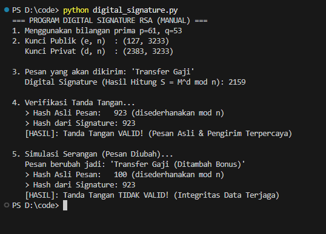

# Laporan Praktikum Kriptografi
Minggu ke-: 9  
Topik: [Digital Signature (RSA/DSA)]  
Nama: [Indra Fata Nizar Azizi]  
NIM: [230202812]  
Kelas: [5IKRA]  

---

## 1. Tujuan
(Tuliskan tujuan pembelajaran praktikum sesuai modul.)
1. Mengimplementasikan tanda tangan digital menggunakan algoritma RSA/DSA.  
2. Memverifikasi keaslian tanda tangan digital.  
3. Menjelaskan manfaat tanda tangan digital dalam otentikasi pesan dan integritas data.  
---

## 2. Dasar Teori
(Ringkas teori relevan (cukup 2–3 paragraf).  
Contoh: .  )

Digital Signature adalah mekanisme otentikasi penting dalam keamanan sistem informasi yang memungkinkan pengirim pesan untuk melampirkan kode unik sebagai bukti identitas. Tanda tangan digital dibentuk dengan cara mengambil intisari (hash) dari pesan asli, yang kemudian dienkripsi menggunakan kunci privat (private key) milik pengirim. Karena kunci privat hanya dimiliki oleh pengirim, tanda tangan ini berfungsi sebagai stempel elektronik yang menjamin bahwa pesan tersebut benar-benar berasal dari sumber yang sah dan isinya belum dimanipulasi oleh pihak lain selama proses pengiriman

Proses verifikasi keaslian dilakukan oleh penerima pesan untuk memastikan validitas tanda tangan tersebut. Penerima akan menjalankan algoritma verifikasi menggunakan kunci publik (public key) milik pengirim terhadap pesan dan tanda tangan yang diterima. Secara teknis, sistem akan melakukan perhitungan matematis untuk membandingkan nilai yang dihasilkan dari pesan yang diterima dengan komponen tanda tangan digitalnya. Jika hasil perhitungan (nilai $v$) sama dengan parameter tanda tangan (nilai $r$), maka tanda tangan dinyatakan valid. Status valid ini mengonfirmasi bahwa pesan tersebut otentik dan pengirimnya adalah pemilik asli dari kunci publik tersebut.

Manfaat utama dari teknologi ini terletak pada jaminan otentikasi pesan dan integritas data. Dalam hal otentikasi, tanda tangan digital memberikan kepastian kepada penerima bahwa mereka sedang berkomunikasi dengan entitas yang benar, bukan penipu. Sedangkan untuk integritas data, mekanisme ini memastikan bahwa data yang diterima persis sama dengan data yang dikirim. Jika terjadi perubahan sekecil apa pun pada pesan saat transmisi, proses verifikasi akan gagal, sehingga penerima mengetahui bahwa data tersebut telah rusak atau diubah. Selain itu, terdapat juga manfaat non-repudiation (anti-penyangkalan), yang mencegah pengirim menyangkal bahwa ia telah mengirim data tersebut

Pendekatan keamanan berlapis dengan menggabungkan algoritma RSA dan DSA. RSA digunakan untuk mengenkripsi pesan agar isinya tidak bisa dibaca (kerahasiaan), sementara DSA (Digital Signature Algorithm) digunakan khusus untuk membuat dan memverifikasi tanda tangan digital. Penelitian ini menyimpulkan bahwa kombinasi RSA 1024-bit untuk enkripsi dan DSA 512-bit untuk tanda tangan digital adalah metode yang paling efisien, karena mampu meningkatkan keamanan data dengan waktu proses enkripsi dan penandatanganan 60% lebih cepat dibandingkan metode lainnya [1]

---

## 3. Alat dan Bahan
(- Python 3.14  
- Visual Studio Code 
- Git dan akun GitHub  
- Library tambahan hashlib, random )

---

## 4. Langkah Percobaan
(Tuliskan langkah yang dilakukan sesuai instruksi.  
Contoh format:

Langkah 1: Generate Key dan Buat Tanda Tangan
1. Persiapan Rumus yang akan dipakai "Alat Hitung"
   - fungsi gcd(a, b) : untuk mencari faktor persekutuan (memastikan angka kunci unik)
   - fungsi multiplicative_inverse : untuk menghitung kunci privat
2. Menentukan Angka yang akan digunakan
   - Program menetapkan dua angka prima: p = 61 dan q = 53, nanti angka ini akan dimasukan kedalam rumus yang sudah   ditentukan sebelumnya
3. Pembuatan Kunci (Key Generation)
   - memanggil fungsi generate_keypair(p, q) dan memasukanya ke rumus untuk menadaptkan kunci publik dan kuci private
4. Menulis Pesan & Tanda Tangan
   - misal kita ingin mengirim pesan "Transfer Gaji"
   - Program memanggil fungsi sign_message disini pesan kita akan jadi kode angka unik (SHA-256).
   - Kode angka itu dihitung dengan rumus: $Angka^{d} \pmod n$
   - Hasil langkah ini terciptalah sebuah deretan angka yang disebut Digital Signature.
  
Langkah 2 — Verifikasi Tanda Tangan
1. Penerima Memeriksa Pesan (Verification)
   - Penerima menjalankan verify_signature
   - Penerima mengambil pesan "Transfer Gaji" dan mengubahnya jadi angka hash.
   - Penerima mengambil Signature, lalu menghitungnya dengan Kunci Publik ($Signature^{e} \pmod n$).
   - Bandingkan: Apakah Hash buatan sendiri == Hash hasil buka Signature? Karena pesannya jujur, hasilnya SAMA.
   - Output Layar: [HASIL]: Tanda Tangan VALID!
  
Langkah 3 — Uji Modifikasi Pesan
1. Simulasi Kejahatan
   - Hacker mengubah pesan menjadi "Transfer Gaji (Ditambah Bonus)
   - Hacker punya pesan baru, tapi tidak punya Kunci Privat (d). Jadi dia tidak bisa membuat Signature baru yang pas. Dia terpaksa menempelkan Signature lama.
2. Verifikasi Pesan Palsu
   - Penerima menerima pesan palsu tersebut dan menjalankan verify_signature lagi
   - Hitung Hash Baru: Penerima menghitung hash dari "Transfer Gaji (Ditambah Bonus)". Hasil angkanya pasti beda jauh dari pesan asli.
   - Buka Signature Lama: Penerima membuka Signature lama dengan Kunci Publik. Hasilnya adalah hash pesan asli.
   - Bandingkan: Hash Pesan Palsu (Baru) TIDAK SAMA DENGAN Hash Pesan Asli (dari Signature).
   - Output Layar: [HASIL]: Tanda Tangan TIDAK VALID!
   

---

## 5. Source Code
(Salin kode program utama yang dibuat atau dimodifikasi.  
Gunakan blok kode:

Langkah 1 — Generate Key dan Buat Tanda Tangan
```python
import hashlib
import random

# --- FUNGSI MATEMATIKA DASAR ---

def gcd(a, b):
    """Mencari Faktor Persekutuan Terbesar (Greatest Common Divisor)"""
    while b != 0:
        a, b = b, a % b
    return a

def multiplicative_inverse(e, phi):
    """
    Mencari kunci privat 'd' dimana (d * e) % phi == 1
    Sesuai PDF: d . e = 1 (mod phi(n))
    """
    d = 0
    x1 = 0
    x2 = 1
    y1 = 1
    temp_phi = phi
    
    while e > 0:
        temp1 = temp_phi // e
        temp2 = temp_phi - temp1 * e
        temp_phi = e
        e = temp2
        
        x = x2 - temp1 * x1
        y = d - temp1 * y1
        
        x2 = x1
        x1 = x
        d = y1
        y1 = y
        
    if temp_phi == 1:
        return d + phi

def generate_keypair(p, q):
    """
    Langkah 1: Key Generation (Pembangkitan Kunci)
    Sesuai PDF [cite: 65-72]
    """
    # 1. Hitung n = p * q 
    n = p * q

    # 2. Hitung phi(n) = (p-1)(q-1) 
    phi = (p - 1) * (q - 1)

    # 3. Pilih public key 'e' yg relatif prima dengan phi(n) [cite: 69]
    # Biasanya e=65537, tapi kita cari random kecil untuk demo
    e = random.randrange(1, phi)
    g = gcd(e, phi)
    while g != 1:
        e = random.randrange(1, phi)
        g = gcd(e, phi)

    # 4. Generate secret key 'd' 
    d = multiplicative_inverse(e, phi)
    
    # Return ((Public Key), (Private Key))
    # Public = (e, n), Private = (d, n) [cite: 71-72]
    return ((e, n), (d, n))

def sign_message(message, private_key):
    """
    Langkah 2: Signing (Pembuatan Tanda Tangan)
    Konsep: Signature = HashedMessage^d mod n
    """
    d, n = private_key
    
    # Buat Hash dari pesan (SHA-256) agar integritas terjaga [cite: 133]
    # Kita ubah hash hex menjadi integer agar bisa dihitung matematika
    hash_obj = hashlib.sha256(message.encode())
    hash_int = int(hash_obj.hexdigest(), 16)
    
    # Rumus RSA untuk Signing: S = M^d mod n
    # (Di Python: pow(base, exp, mod))
    signature = pow(hash_int, d, n)
    
    return signature
```
Langkah 2 — Verifikasi Tanda Tangan
```python
def verify_signature(message, signature, public_key):
    """
    Langkah 3: Verifying (Verifikasi)
    Konsep: Hash' = Signature^e mod n. Jika Hash' == Hash Asli, maka Valid.
    """
    e, n = public_key
    
    # Hitung ulang hash dari pesan yang diterima
    hash_obj = hashlib.sha256(message.encode())
    hash_int = int(hash_obj.hexdigest(), 16)
    
    # Dekripsi Tanda Tangan: HashDecrypted = Signature^e mod n
    # Sesuai konsep invers enkripsi [cite: 79-81]
    hash_from_signature = pow(signature, e, n)
    
    print(f"   > Hash Asli Pesan:   {hash_int % n} (disederhanakan mod n)")
    print(f"   > Hash dari Signature: {hash_from_signature}")

    if hash_int % n == hash_from_signature:
        return True
    else:
        return False
```

Langkah 3 — Uji Modifikasi Pesan
```python
# --- BAGIAN UTAMA (MAIN) ---
if __name__ == "__main__":
    print("=== PROGRAM DIGITAL SIGNATURE RSA (MANUAL) ===")
    
    # A. INPUT BILANGAN PRIMA (P dan Q)
    # Di dunia nyata P dan Q harus sangaaat besar. 
    # Di sini kita pakai angka kecil supaya proses hitungnya kelihatan cepat.
    p = 61
    q = 53
    print(f"1. Menggunakan bilangan prima p={p}, q={q}")

    # B. GENERATE KEY
    public_key, private_key = generate_keypair(p, q)
    print(f"2. Kunci Publik (e, n)  : {public_key}")
    print(f"   Kunci Privat (d, n)  : {private_key}")

    # C. PROSES TANDA TANGAN (SIGNING)
    pesan = "Transfer Gaji"
    print(f"\n3. Pesan yang akan dikirim: '{pesan}'")
    
    signature = sign_message(pesan, private_key)
    print(f"   Digital Signature (Hasil Hitung S = M^d mod n): {signature}")

    # D. PROSES VERIFIKASI (VERIFYING)
    print(f"\n4. Verifikasi Tanda Tangan...")
    is_valid = verify_signature(pesan, signature, public_key)
    
    if is_valid:
        print("   [HASIL]: Tanda Tangan VALID! (Pesan Asli & Pengirim Terpercaya)")
    else:
        print("   [HASIL]: Tanda Tangan PALSU!")

    # E. SIMULASI PEMALSUAN
    print(f"\n5. Simulasi Serangan (Pesan Diubah)...")
    pesan_palsu = "Transfer Gaji (Ditambah Bonus)"
    print(f"   Pesan berubah jadi: '{pesan_palsu}'")
    is_valid_palsu = verify_signature(pesan_palsu, signature, public_key)
    if is_valid_palsu:
        print("   [HASIL]: Tanda Tangan VALID!")
    else:
        print("   [HASIL]: Tanda Tangan TIDAK VALID! (Integritas Data Terjaga)")
```


## 6. Hasil dan Pembahasan
(- Lampirkan screenshot hasil eksekusi program (taruh di folder `screenshots/`).  

Hasil eksekusi program siganture.py :


)

---
---

## 7. Jawaban Pertanyaan
(Jawab pertanyaan diskusi yang diberikan pada modul.  
- Pertanyaan 1: Perbedaan utamanya terletak pada tujuannya dan urutan penggunaan kunci
  1. Tanda tangan digital RSA
     - tujuan : Membuktikan keaslian pengirim dan keutuhan pesan.
     - Proses : menggunakan Kunci Privat (d) untuk menandatangani (mengacak), dan orang lain menggunakan Kunci Publik (e) untuk memverifikasi.
  3. Enkripsi RSA
     - tujuan : Menjaga kerahasiaan pesan agar tidak bisa dibaca orang lain
     - Proses : Orang lain menggunakan Kunci Publik Anda untuk mengunci pesan, dan hanya Anda yang bisa membuka pesan tersebut dengan Kunci Privat.
- Pertanyaan 2:
  1. Tanda tangan digital tidak dibuat dari pesan mentah, melainkan dari "sidik jari" (hash) pesan tersebut. Jika satu huruf saja diubah pada pesan asli, nilai hash-nya akan berubah drastis.
  2. Secara matematis, hanya kunci privat (d) pasangan dari kunci publik (e) yang bisa menghasilkan angka signature yang valid. Karena kunci privat hanya dimiliki oleh pemilik asli, maka penerima yakin pesan itu benar-benar dari pemilik tersebut

- Pertanyaan 3: Peran CA adalah memindahkan kepercayaan. Alih-alih setiap orang harus saling percaya secara manual (yang mustahil dilakukan di internet global), kita cukup percaya pada segelintir Lembaga CA. Jika CA bilang "Ini kunci si Budi", maka sistem kita percaya itu Budi.
)
---

## 8. Kesimpulan
(Tuliskan kesimpulan singkat (2–3 kalimat) berdasarkan percobaan.  )

Percobaan ini membuktikan bahwa Tanda Tangan Digital RSA berhasil menjamin integritas dan otentikasi, di mana setiap modifikasi sekecil apa pun pada pesan akan menyebabkan ketidakcocokan nilai hash saat verifikasi. Hal ini menunjukkan bahwa hanya pemegang Kunci Privat asli yang dapat membuat tanda tangan yang valid, sehingga penerima dapat yakin bahwa pesan tersebut murni dan berasal dari pengirim yang sah.

---

## 9. Daftar Pustaka
(Cantumkan referensi yang digunakan.  
Contoh:  
[1] F. J. Aufa, Endroyono, and A. Affandi, "Security System Analysis in Combination Method: RSA Encryption and Digital            Signature Algorithm," in 2018 4th International Conference on Science and Technology (ICST), Yogyakarta, Indonesia, 2018.

---

## 10. Commit Log
(Tuliskan bukti commit Git yang relevan.  
Contoh:
```
Author: Indra Fata Nizar Azizi <indrafata980@gmail.com>
Date:   2025-12-15

    week9-digital-signature: Digital Signature (RSA/DSA) )
```
